# Class Profiles Based on XAI Analysis — Alien Hobbies Dataset

## Table of Contents
- [Model and Dataset](#model-and-dataset)
- [Explanation Methods Used](#explanation-methods-used)
- [Short Note on Analysis Goals and Terminology](#short-note-on-analysis-goals-and-terminology)
- [Global Shapley Values for All Classes](#global-shapley-values-for-all-classes)
- [Zarnak](#zarnak)
  - [Key Features from SHAP](#key-features-from-shap)
  - [Cluster-Based SHAP Analysis](#cluster-based-shap-analysis)
  - [Anchor Explanations](#anchor-explanations)
  - [Tree Extraction and Impact Analysis](#tree-extraction-and-impact-analysis)
  - [Zarnak Profile Selection and Visualization](#zarnak-profile-selection-and-visualization)
  - [PDP (1D and 2D) Analysis for Zarnak Class](#pdp-1d-and-2d-analysis-for-zarnak-class)
  - [Zarnak Class Summary Profile](#zarnak-class-summary-profile)
- [Bliptor](#bliptor)
  - [Key Features from SHAP](#key-features-from-shap-1)
  - [Cluster-Based SHAP Analysis](#cluster-based-shap-analysis-1)
  - [Anchor Explanations](#anchor-explanations-1)
  - [Tree Extraction and Impact Analysis](#tree-extraction-and-impact-analysis-1)
  - [Bliptor Profile Selection and Visualization](#bliptor-profile-selection-and-visualization)
  - [PDP (1D and 2D) Analysis for Bliptor Class](#pdp-1d-and-2d-analysis-for-bliptor-class)
  - [Bliptor Class Summary Profile](#bliptor-class-summary-profile)
- [Quorvian](#quorvian)
  - [Key Features from SHAP](#key-features-from-shap-2)
  - [Cluster-Based SHAP Analysis](#cluster-based-shap-analysis-2)
  - [Anchor Explanations](#anchor-explanations-2)
  - [Tree Extraction and Impact Analysis](#tree-extraction-and-impact-analysis-2)
  - [Quorvian Profile Selection and Visualization](#quorvian-profile-selection-and-visualization)
  - [PDP (1D and 2D) Analysis for Quorvian Class](#pdp-1d-and-2d-analysis-for-quorvian-class)
  - [Quorvian Class Summary Profile](#quorvian-class-summary-profile)

## Model and Dataset

- **Model**: Random Forest Classifier
- **Dataset**: Alien Hobbies Dataset (synthetic)
- **Classes**: 
  - Zarnak
  - Bliptor
  - Quorvian
- **Features** (measured in hours per week, scale 0–14):
  - Tool Worship
  - Reality Show Studies
  - Plant Telepathy Practice
  - Box Collecting
  - Laser Pointer Chasing

**Dataset Description**:  
The Alien Hobbies Dataset captures hypothetical weekly activities and interests of three distinct alien species. Each instance represents an individual alien's time allocation across five hobbies, designed to simulate unique lifestyle patterns within and across classes. The data is synthetically generated but reflects complex, nonlinear decision boundaries, making it appropriate for XAI analysis.

---

## Explanation Methods Used

To understand how the Random Forest model predicts each alien class, a comprehensive suite of explanation techniques was applied:

- **SHAP (SHapley Additive exPlanations)**:
  - Global class-level feature importance analysis
  - Cluster-based subgroup analysis within each class

- **Anchors**:
  - Local, high-precision rules identifying feature combinations that strongly predict a given class

- **Tree Rule Extraction**:
  - Extraction of decision paths from the Random Forest trees
  - Focused on short, interpretable paths to explain model behavior globally

- **Partial Dependence Plots (PDP) and Individual Conditional Expectation (ICE) Plots**:
  - Visual analysis of feature effects
  - 1D and 2D plots to understand individual and interactive impacts of features on class probability

**Goal**:  
Provide both global and local insights into how feature patterns influence model predictions across the three alien species, identify heterogeneous behavior within classes, and build intuitive, interpretable profiles for each alien type.

## Short Note on Analysis Goals and Terminology

In this analysis, we aim to construct **class profiles** for the **Random Forest (RF)** model.  
Our focus is on four aspects:
- **Feature importance**,
- **Direction of feature influence**,
- **Characteristic feature ranges**,
- **Impactful feature interactions**
- **Distinct profiles (subgroups)** within each class.

When describing the **direction of importance**, we refer to the effect a feature has on the prediction, without implying its strength (magnitude).

Specifically:
- A **positive direction/impact** means that **higher feature values increase the probability of predicting the target class**.
- A **negative direction/impact** means that **lower feature values increase the probability of predicting the target class**.
- A **mixed impact** means that **higher feature values can both increase and decrease the probability depending on the feature values**.
For describing feature value ranges, we adopt the following convention:

- **Low range**: 0–5
- **Moderate range**: 5–10
- **High range**: 10–15

## Global Shapley Values for All Classes

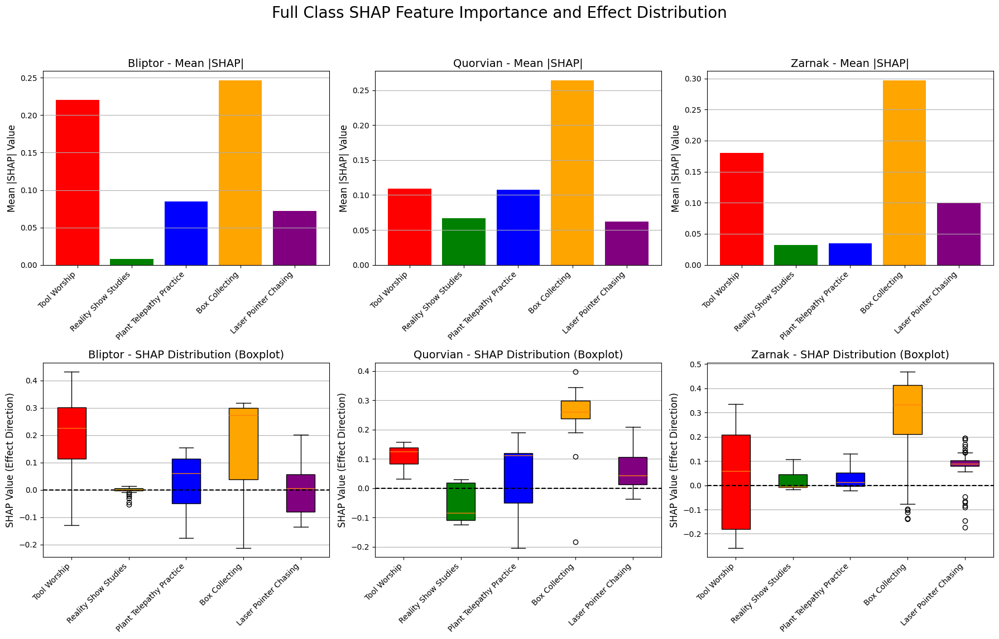

# Zarnak

## Key Features from SHAP

- **Box Collecting** is the strongest feature for predicting Zarnak.
  - It consistently shows the highest mean SHAP values across different analyses.
- **Tool Worship** is the second most influential feature.
  - Positive contribution but slightly lower than Box Collecting.
- **Laser Pointer Chasing** plays a moderate role.
  - It has lower importance compared to Box Collecting and Tool Worship.
- **Reality Show Studies** and **Plant Telepathy Practice** have minimal influence.
  - Both features show very low mean SHAP values.
  - Reality Show Studies tends to have a very minor negative to neutral impact.

> **Insight**: Zarnak classification is **primarily driven by Box Collecting**, with support from Tool Worship and, to a lesser extent, Laser Pointer Chasing. Other activities contribute little to the model's decisions.

---

## Cluster-Based SHAP Analysis

The Zarnak class shows **internal heterogeneity** when clustered into subgroups based on SHAP values:

- **Across 2 Clusters**:
  - **Box Collecting** remains dominant in both clusters.
  - **Tool Worship** has slightly higher importance in Cluster 0 compared to Cluster 1.
  - Minor differences are observed for Reality Show Studies and Plant Telepathy Practice.

- **Across 3 Clusters**:
  - **Cluster 2** shows a notably higher emphasis on **Box Collecting** compared to others.
  - **Tool Worship** importance is relatively stable across clusters.
  - **Reality Show Studies** and **Plant Telepathy Practice** remain secondary.

- **Across 4 Clusters**:
  - Some clusters prioritize **Tool Worship** slightly more while others rely almost exclusively on **Box Collecting**.
  - A bit more variation in minor features (Reality Show Studies and Plant Telepathy Practice) begins to appear.

- **Across 5 Clusters**:
  - **Cluster 2** again shows a very high reliance on **Box Collecting**.
  - **Tool Worship** shows its highest importance in **Cluster 3**.
  - Minor features (Reality Show Studies, Plant Telepathy Practice) have small fluctuations across clusters but remain relatively insignificant.

> **Summary**:  
> Despite some variability in secondary features, **Box Collecting consistently dominates Zarnak prediction** across all cluster granularities. **Tool Worship** emerges as the secondary but important feature, while **Laser Pointer Chasing** maintains a moderate, stable role across subgroups.

---

### SHAP Values for Subgroups within the Zarnak Class

|                         Plot                          | Number of Subgroups (KMeans) in Zarnak Class |
|:-----------------------------------------------------:|:-------------------------------------------:|
| 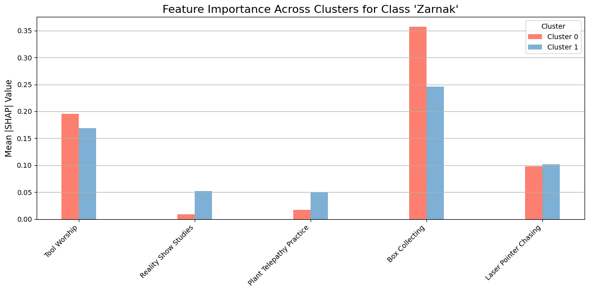 | 2 subgroups |
|           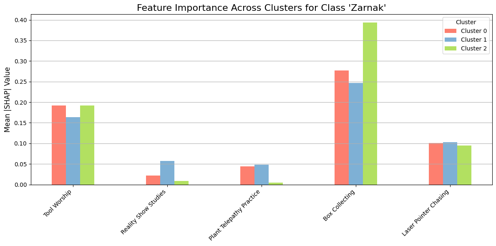           | 3 subgroups |
|           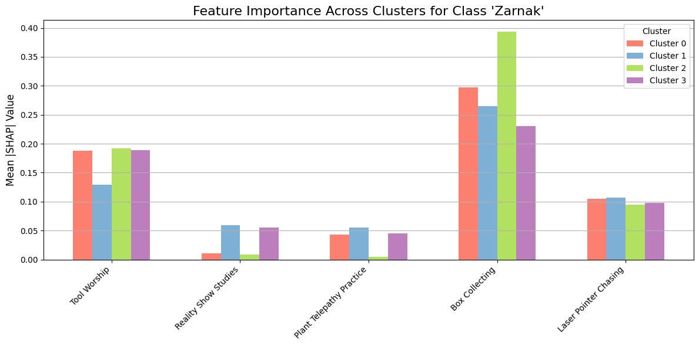           | 4 subgroups |
|           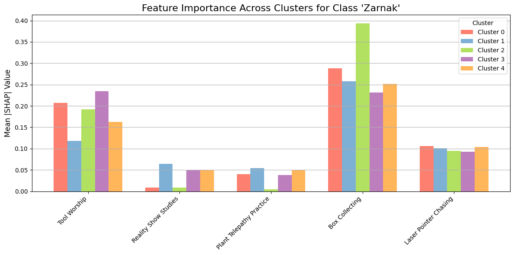           | 5 subgroups |

---

### Zarnak Anchor Explanations

| Anchor | Conditions | Precision | Coverage |
|:------:|:-----------|:---------:|:--------:|
| 1 | `Box Collecting <= 3.00` | 1.000 | 31.70% |
| 2 | `Box Collecting <= 3.00` | 0.958 | 31.27% |
| 3 (non-eligible, lower precision) | `Box Collecting <= 4.99`, `Laser Pointer Chasing <= 6.99`, `Tool Worship > 6.99`, `Plant Telepathy Practice <= 10.01` | 0.947 | 22.25% |

#### Interpretation

- **Anchor 1**:
  - Zarnaks with very low Box Collecting (≤3.00) are predicted with perfect precision (100%), covering nearly one-third of the class.
- **Anchor 2**:
  - Same condition but slightly lower precision (95.76%) and similar coverage.
- **Anchor 3**:
  - A more complex rule, involving Box Collecting, Laser Pointer Chasing, Tool Worship, and Plant Telepathy Practice, with lower precision (94.68%).

> **Conclusion**: Zarnak classification is strongly associated with low Box Collecting behavior. Additional conditions slightly expand coverage but at the cost of lower precision.

---
## Tree Extraction and Impact Analysis

### Approach

- Extracted decision rules from individual trees in the Random Forest.
- Focused on paths leading to the Zarnak class.
- Selected short, interpretable trees (2–4 conditions) for visualization.
- Built full decision tree diagrams to show key splits, branches, and predictions.

---

### Impact on Analysis

| Aspect | Impact                                                                                                                                    |
|:------|:------------------------------------------------------------------------------------------------------------------------------------------|
| **Understanding Key Features** | Highlighted Tool Worship, Box Collecting, Laser Pointer Chasing, and Plant Telepathy Practice as improtant features.                      |
| **Finding Important Thresholds** | Revealed important splits (e.g., Tool Worship > 7.5, Box Collecting ≤ 3.5, Laser Pointer Chasing ≤ 7.5, Plant Telepathy Practice ≤ 10.5). |
| **Identifying Feature Interactions** | Showed that combinations of low Box Collecting and high Tool Worship drive Zarnak predictions.                                            |
| **Recognizing Heterogeneity** | We were able to identify several types of Zarnak profiles.                                                                                |

---

### General Behavior of Zarnak Class

- **Heterogeneous Decision Patterns**:  
  Zarnak predictions emerge through multiple combinations of **high Tool Worship**, **low Box Collecting**, and **low Laser Pointer Chasing**.
  
- **Tool Worship** is the most stable positive indicator — high Tool Worship scores (>7.5) strongly favor Zarnak classification.
- **Box Collecting** acts as a critical negative indicator — low Box Collecting (≤3.5) strongly supports Zarnak predictions.
- **Laser Pointer Chasing** plays a supporting role — moderate to low values (≤7.5) reinforce Zarnak likelihood.
- **Plant Telepathy Practice** contributes positively in more complex decision paths when combined with low Reality Show Studies.

> **Conclusion**: Zarnak classification is primarily driven by **high engagement in Tool Worship**, **low Box Collecting**, and **moderately low Laser Pointer Chasing** behavior.

---

### Zarnak Profile Selection and Visualization

#### Approach to Profile Selection

Three Zarnak profiles were selected based on extracted decision trees to illustrate the diversity within the Zarnak class:

| Profile | Key Features | Represents |
|:---|:---|:---|
| **Tool-Worship Focused Zarnak** | High Tool Worship, Low Box Collecting | "Devotee Zarnak" |
| **Low Activity Zarnak** | Low Box Collecting, Low Laser Pointer Chasing | "Calm Zarnak" |
| **Balanced Worship and Practice Zarnak** | High Tool Worship, Moderate Plant Telepathy Practice, Low Reality Show Studies | "Balanced Thinker Zarnak" |

---

#### Zarnak Profile Visualizations

| Profile | Decision Tree Visualization | Key Notes |
|:-------------------------------------------------|:--------------------------------------------------------------------------|:---|
| **Tool-Worship Focused Zarnak** | 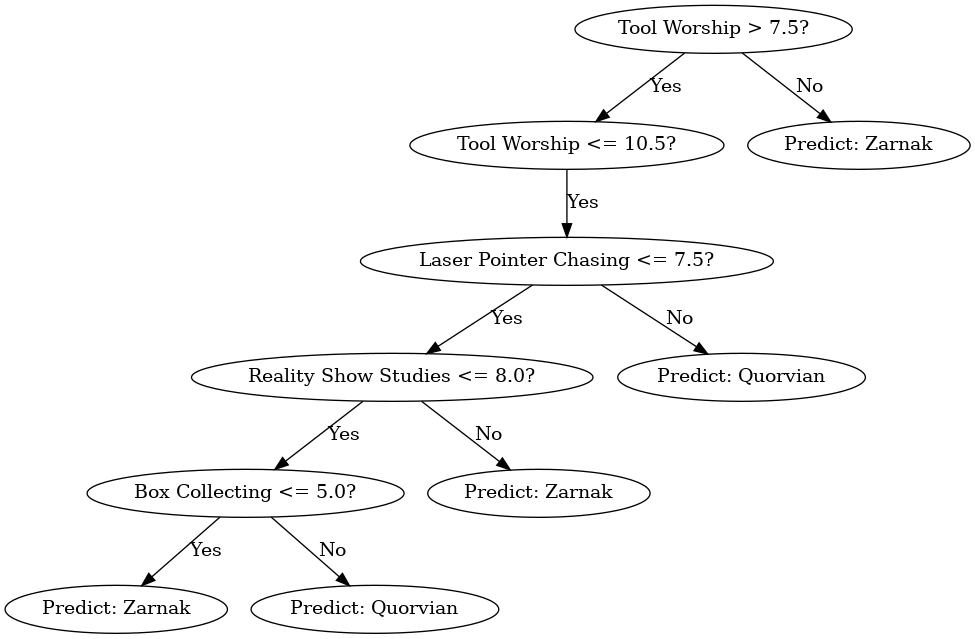 | High Tool Worship (>7.5) and low Box Collecting (≤5.0) predict Zarnak. |
| **Low Activity Zarnak** | 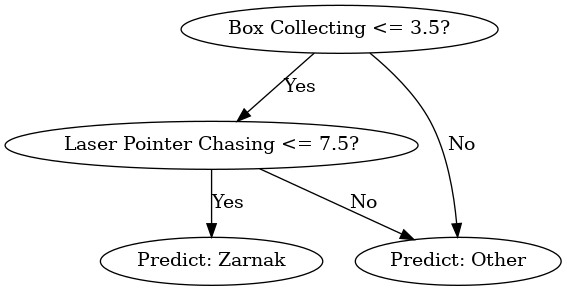 | Low Box Collecting (≤3.5) and low Laser Pointer Chasing (≤7.5) lead to Zarnak. |
| **Balanced Worship and Practice Zarnak** | 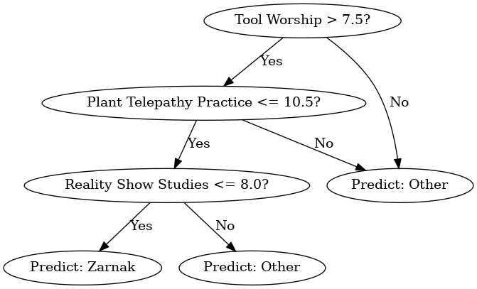 | High Tool Worship (>7.5) combined with moderate Plant Telepathy Practice (≤10.5) and low Reality Show Studies (≤8.0) predict Zarnak. |

---

### PDP (1D and 2D) Analysis for Zarnak Class

Partial Dependence Plots (PDP) and Individual Conditional Expectation (ICE) plots provide further insight into **how individual features influence the probability of predicting Zarnak**.

#### 1D PDP + ICE Observations

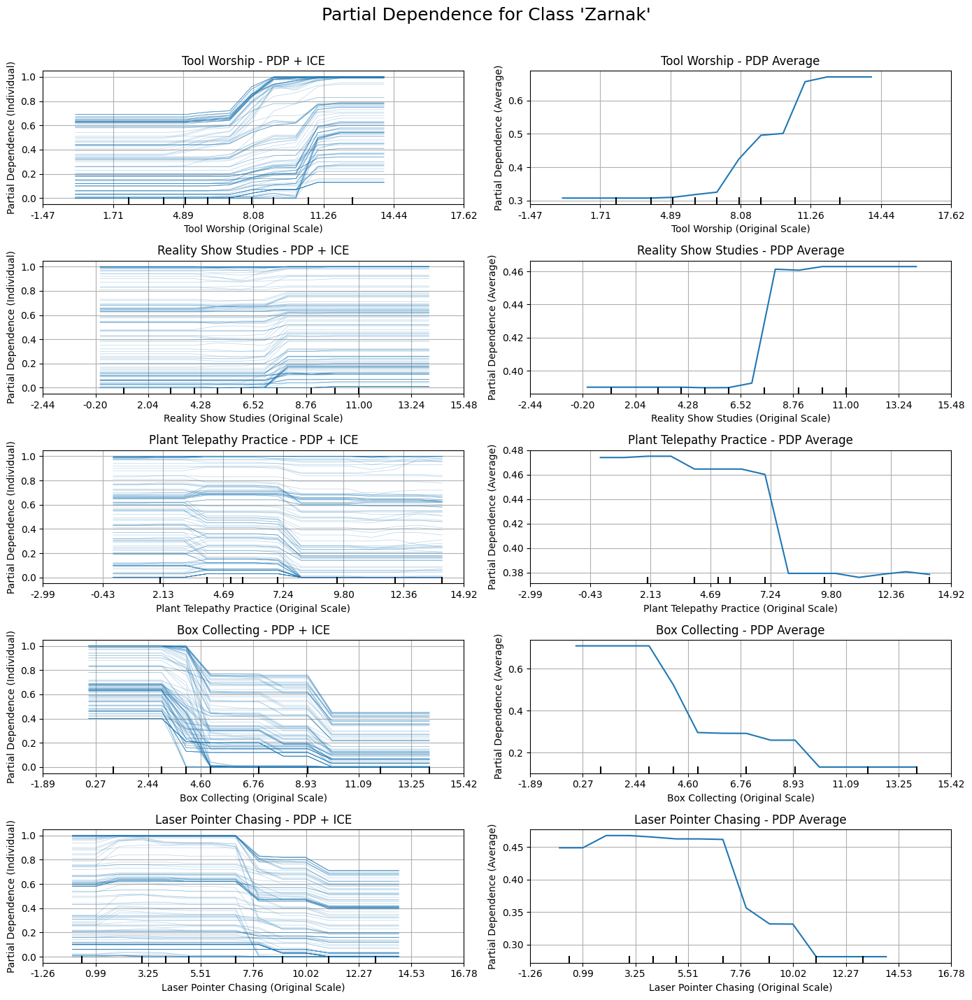

- **Tool Worship**:  
  Probability of Zarnak prediction increases sharply after Tool Worship exceeds approximately 7–8 on the original scale.  
  Higher Tool Worship values (above 10) maintain consistently high prediction probabilities.

- **Reality Show Studies**:  
  Very low Reality Show Studies (<5) slightly support Zarnak predictions.  
  Probability of Zarnak decreases as Reality Show Studies increase beyond 7–8.

- **Plant Telepathy Practice**:  
  Moderate Plant Telepathy Practice (~5–8) is associated with a slightly higher probability of Zarnak classification.  
  Higher values (>9) cause a decrease in probability.

- **Box Collecting**:  
  Zarnak probability **decreases steadily** with higher Box Collecting.  
  Very low Box Collecting values (0–4) strongly favor Zarnak prediction.

- **Laser Pointer Chasing**:  
  Lower Laser Pointer Chasing values (≤5) moderately support Zarnak classification.  
  Higher values decrease the probability, though the effect is smaller compared to Box Collecting.

> **Insight**: High Tool Worship, low Box Collecting, and low Reality Show Studies are strong predictors for Zarnak.

---

#### 2D PDP Observations

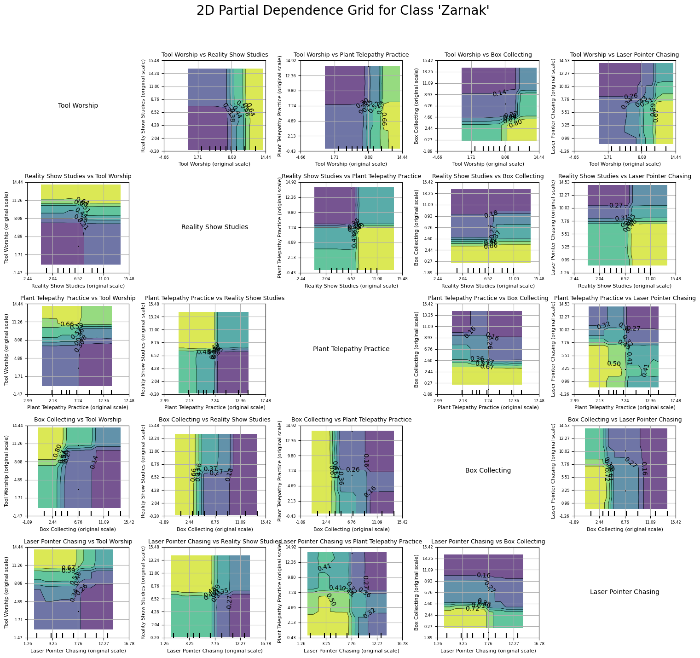

- **Tool Worship vs Reality Show Studies**:  
  Highest Zarnak probability occurs when Tool Worship is high and Reality Show Studies is low.  
  High Reality Show engagement reduces the Zarnak prediction even when Tool Worship is strong.

- **Tool Worship vs Plant Telepathy Practice**:  
  Moderate Plant Telepathy Practice combined with high Tool Worship further strengthens Zarnak prediction.

- **Tool Worship vs Box Collecting**:  
  High Tool Worship and low Box Collecting work together to maximize the probability of Zarnak classification.

- **Reality Show Studies vs Plant Telepathy Practice**:  
  Low Reality Show Studies combined with moderate Plant Telepathy Practice favor Zarnak.

- **Reality Show Studies vs Box Collecting**:  
  Low Reality Show Studies and low Box Collecting boost Zarnak probability significantly.

- **Box Collecting vs Laser Pointer Chasing**:  
  Low Box Collecting and moderate to low Laser Pointer Chasing result in higher Zarnak predictions.

> **Conclusion**:  
> Zarnak predictions are strongest when instances show **high Tool Worship**, **low Box Collecting**, and **low Reality Show Studies**,  
> with **moderate Plant Telepathy Practice** providing additional support.

## Zarnak Class Summary Profile

### 1. Most Influential Features and Their Behavior
- **Box Collecting** is the strongest but negative indicator.
  - Zarnak probability **decreases steadily** as Box Collecting increases.
  - Very low Box Collecting (0–4) **strongly favors** Zarnak classification.

- **Tool Worship** is the most influential positive feature overall.
  - Zarnak probability **rises sharply** when Tool Worship exceeds **7–8** on the original scale.
  - Very high Tool Worship (>10) maintains consistently high Zarnak prediction.

- **Laser Pointer Chasing** has a **moderate nagative role**.
  - Lower Laser Pointer Chasing (≤5) supports Zarnak predictions.
  - Higher Laser Pointer Chasing values (>8) slightly reduce Zarnak probability.

- **Reality Show Studies** play a **minor negative role**.
  - Very low Reality Show Studies (<5) **slightly favor** Zarnak prediction.
  - Higher Reality Show Studies (>8) decrease Zarnak probability.

- **Plant Telepathy Practice** has a **weak negative influence** at moderate levels.
  - Moderate Plant Telepathy Practice (5–8) enhances Zarnak prediction slightly.
  - Higher values (>9) reduce the likelihood.

---

### 2. Key Ranges for Main Features

| Feature                  | Positive Range (for Zarnak) | Negative Range (against Zarnak) |
|:-------------------------|:----------------------------|:--------------------------------|
| Tool Worship             | > 7                         | < 5                             |
| Box Collecting           | < 4                         | > 6                             |
| Laser Pointer Chasing    | < 5 (supportive)            | > 8                             |
| Reality Show Studies     | < 5 (minor support)         | > 8                             |
| Plant Telepathy Practice | 5–8 (weak support)          | > 9                             |

---

### 3. Feature Interactions

- **Tool Worship + Box Collecting**:
  - High Tool Worship combined with low Box Collecting **maximizes Zarnak probability**.
  - If Box Collecting is high even with strong Tool Worship, Zarnak probability decreases.

- **Tool Worship + Reality Show Studies**:
  - High Tool Worship with low Reality Show Studies strongly favors Zarnak.
  - High Reality Show Studies weaken the Tool Worship advantage.

- **Box Collecting + Laser Pointer Chasing**:
  - Very low Box Collecting combined with moderate-low Laser Pointer Chasing further boosts Zarnak prediction.

- **Reality Show Studies + Plant Telepathy Practice**:
  - Low Reality Show Studies combined with moderate Plant Telepathy Practice supports Zarnak classification, though weakly.

---

### 4. Subgroups Inside Zarnak Class (Zarnak Profiles)

- **Tool-Worship Focused Zarnak**:
  - **High Tool Worship**, **Low Box Collecting**.
  - Represents highly engaged, dedicated Zarnaks relying mainly on tool devotion.

- **Low Activity Zarnak**:
  - **Low Box Collecting**, **Low Laser Pointer Chasing**.
  - Represents calmer Zarnaks with low physical hobby involvement.

- **Balanced Worship and Plant Telepathy Practice Zarnak**:
  - **High Tool Worship**, **Moderate Plant Telepathy Practice**, **Low Reality Show Studies**.
  - Balanced intellectual and worship-based Zarnak subgroup with minimal media engagement.

> **Overall Insight**:
> - Zarnak classification is **primarily driven by low Box Collecting** combined with **high Tool Worship**.  
> - **Moderate Laser Pointer Chasing** and **low Reality Show Studies** act as supportive secondary features.  
> - Multiple **Zarnak behavior strategies** exist, depending on balance between spiritual, telepathic, and low-media engagement activities.

---

# Bliptor

## Key Features from SHAP

- **Box Collecting** is the strongest feature for predicting Bliptor.
  - It shows the highest mean SHAP value among all features.
- **Tool Worship** is the second most influential feature.
  - Strong contribution but slightly lower than Box Collecting.
- **Plant Telepathy Practice** plays a moderate role.
- **Laser Pointer Chasing** has a minor but consistent influence.
  - Small positive contribution to Bliptor prediction.
- **Reality Show Studies** has very minimal impact.
  - Very low mean SHAP value, with nearly neutral or slightly negative contribution.

> **Insight**: Bliptor classification is **primarily driven by a combination of Box Collecting and Tool Worship**, with Plant Telepathy Practice offering secondary support.

---

## Cluster-Based SHAP Analysis

The Bliptor class shows **some internal variability** when clustering based on SHAP values:

- **Across 2 Clusters**:
  - **Box Collecting** and **Tool Worship** remain dominant in both clusters.
  - Minor differences in Plant Telepathy Practice across clusters.
  
- **Across 3 Clusters**:
  - **Cluster 2** exhibits higher **Tool Worship** importance.
  - **Box Collecting** remains highly relevant across all clusters but varies slightly in strength.

- **Across 4 Clusters**:
  - **Cluster 3** shows a significant increase in **Tool Worship** importance compared to others.
  - A notable decrease in **Box Collecting** influence is observed in this cluster.
  - Minor features (Laser Pointer Chasing and Plant Telepathy Practice) gain relatively more importance in some clusters.

- **Across 5 Clusters**:
  - **Cluster 3** still has the highest **Tool Worship** influence.
  - **Box Collecting** stays dominant but shows more cluster-to-cluster variation.
  - **Laser Pointer Chasing** becomes a more prominent secondary feature in some clusters.

> **Summary**:  
> Although **Box Collecting** and **Tool Worship** are consistently the primary features across all Bliptor clusters, the **relative strength between the two varies significantly**.  
> Certain Bliptor subgroups rely more on Tool Worship, while others maintain a heavier reliance on Box Collecting.  
> **Plant Telepathy Practice** and **Laser Pointer Chasing** emerge more prominently in specific clusters but are generally secondary.

---

### SHAP Values for Subgroups within the Bliptor Class

|                                              Plot                                              | Number of Subgroups (KMeans) in Bliptor Class |
|:----------------------------------------------------------------------------------------------:|:-------------------------------------------:|
|                     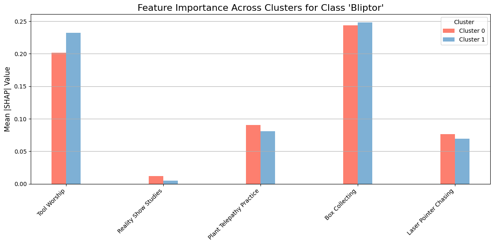                     | 2 subgroups |
|                     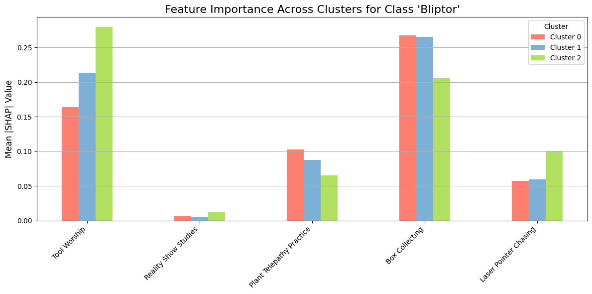                     | 3 subgroups |
|                     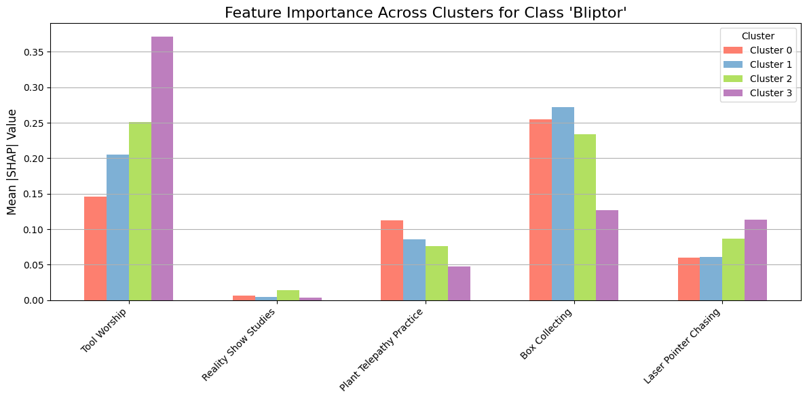                     | 4 subgroups |
|                                                               | 5 subgroups |

---
## Anchor Explanations

Anchor explanations identify feature conditions under which the model predicts a specific class with high precision. Below are the main anchor rules for each class.

---

| Anchor | Conditions | Precision | Coverage |
|:------:|:-----------|:---------:|:--------:|
| 1 | `Box Collecting > 9.01`, `Tool Worship <= 4.99` | 1.000 | 14.89% |
| 2 | `Box Collecting > 9.01`, `Tool Worship <= 4.99` | 1.000 | 14.51% |
| 3 (non-eligible, lower precision) | `Box Collecting > 4.99`, `Tool Worship <= 6.99`, `Plant Telepathy Practice <= 3.00`, `Laser Pointer Chasing > 8.98`, `Reality Show Studies > 9.01` | 0.950 | 1.40% |

#### Interpretation

- **Anchor 1 and 2**:
  - Bliptors with very high Box Collecting (>9.01) and low Tool Worship (≤4.99) are predicted with perfect precision (100%).
  - These two anchors independently cover around 14–15% of the Bliptor class each.
- **Anchor 3**:
  - A more complex rule involving multiple features.
  - Precision is slightly below the 95% threshold (94.98%) and covers only 1.4% of instances.

> **Conclusion**: Bliptor predictions are primarily anchored by a combination of high Box Collecting and low Tool Worship.

---
## Tree Extraction and Impact Analysis

### Approach

- Extracted decision rules from individual trees in the Random Forest.
- Focused on paths leading to the Bliptor class.
- Selected short, interpretable trees (2–4 conditions) for visualization.
- Built full decision tree diagrams to show key splits, branches, and predictions.

---

### Impact on Analysis

| Aspect | Impact |
|:------|:-------|
| **Understanding Key Features** | Highlighted Box Collecting, Tool Worship, and Laser Pointer Chasing as dominant features. |
| **Finding Important Thresholds** | Revealed important splits (e.g., Box Collecting > 7.5, Tool Worship ≤ 7.5, Laser Pointer Chasing > 8.0). |
| **Identifying Feature Interactions** | Showed that combinations of moderate Tool Worship and high Box Collecting or Laser Pointer Chasing drive Bliptor predictions. |
| **Recognizing Heterogeneity** | Different decision paths reflect multiple types of Bliptor profiles based on hobby intensity. |

---

### General Behavior of Bliptor Class

- **Heterogeneous Decision Patterns**:  
  Bliptor predictions arise from different combinations of **high Box Collecting**, **moderate Tool Worship**, and **high Laser Pointer Chasing**.

- **Box Collecting** is a critical positive indicator — high Box Collecting scores (>7.5) increase the probability of Bliptor classification.
- **Tool Worship** acts as a moderating feature — Bliptors often show moderate levels (≤7.5) compared to other classes.
- **Laser Pointer Chasing** positively differentiates Bliptors — high values (>8.0) strengthen predictions.
- **Plant Telepathy Practice** and **Reality Show Studies** play supportive roles in more complex paths.

> **Conclusion**: Bliptor classification is strongly driven by a mix of **moderate engagement in Tool Worship** and **high interest in Box Collecting or Laser Pointer Chasing activities**.

---

### Bliptor Profile Selection and Visualization

#### Approach to Profile Selection

Three Bliptor profiles were selected based on real extracted decision trees to illustrate the diversity within the Bliptor class:

| Profile | Key Features | Represents |
|:---|:---|:---|
| **Box-Collecting Focused Bliptor** | High Box Collecting, Moderate Tool Worship | "Collector Bliptor" |
| **Laser Chasing Focused Bliptor** | High Laser Pointer Chasing, Moderate Plant Telepathy Practice | "Dynamic Bliptor" |
| **Mixed Activity Bliptor** | Moderate Box Collecting, Moderate Laser Pointer Chasing, Low Reality Show Studies | "Balanced Hobbyist Bliptor" |

---

#### Bliptor Profile Visualizations

| Profile | Decision Tree Visualization | Key Notes |
|:-------------------------------------------------|:--------------------------------------------------------------------------|:---|
| **Box-Collecting Focused Bliptor** |  | Moderate Tool Worship (≤7.5) and high Box Collecting (>7.5) predict Bliptor. |
| **Laser Chasing Focused Bliptor** | 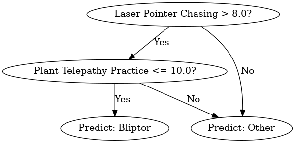 | High Laser Pointer Chasing (>8.0) and moderate Plant Telepathy Practice (≤10.0) favor Bliptor classification. |
| **Mixed Activity Bliptor** | 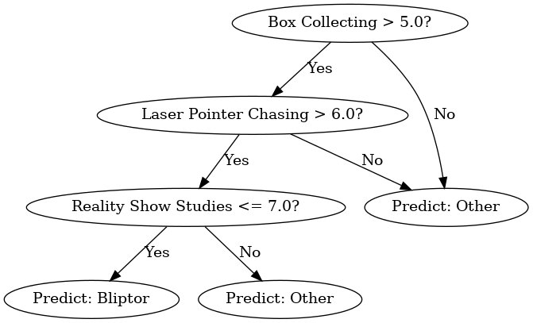 | Moderate Box Collecting (>5.0), moderate Laser Pointer Chasing (>6.0), and low Reality Show Studies (≤7.0) predict Bliptor. |

---

### PDP (1D and 2D) Analysis for Bliptor Class

Partial Dependence Plots (PDP) and Individual Conditional Expectation (ICE) plots provide further insight into **how individual features influence the probability of predicting Bliptor**.

#### 1D PDP + ICE Observations

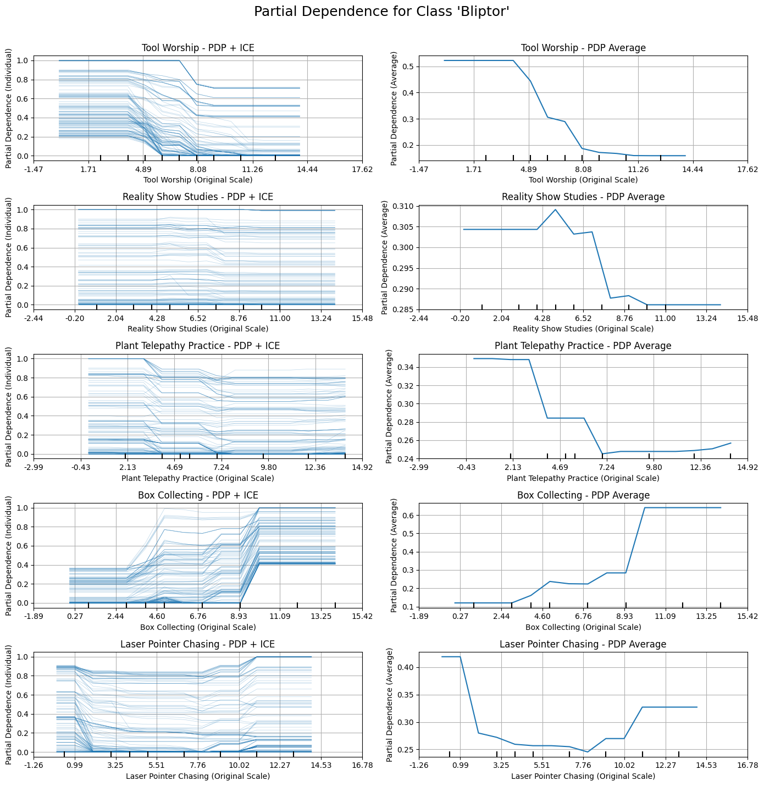

- **Tool Worship**:  
  Probability of predicting Bliptor decreases significantly when Tool Worship exceeds approximately 6–8.  
  Low to moderate Tool Worship values (<6) favor Bliptor classification.

- **Reality Show Studies**:  
  A moderate positive peak around 4–7 is observed.  
  Very high Reality Show Studies (>8) slightly decrease Bliptor probability.

- **Plant Telepathy Practice**:  
  Moderate Plant Telepathy Practice (4–7) supports Bliptor classification.  
  Extremely high telepathy engagement (>9) reduces probability.

- **Box Collecting**:  
  Bliptor probability **increases steadily** with higher Box Collecting.  
  Beyond 8–9 on the original scale, Box Collecting strongly supports Bliptor predictions.

- **Laser Pointer Chasing**:  
  Low to moderate Laser Pointer Chasing (around 4–8) positively influences Bliptor classification.  
  Very low (<3) or very high (>12) Laser Pointer Chasing slightly reduces prediction probability.

> **Insight**: Low to moderate Tool Worship, moderate Plant Telepathy Practice, and high Box Collecting are strong predictors for Bliptor.

---

#### 2D PDP Observations

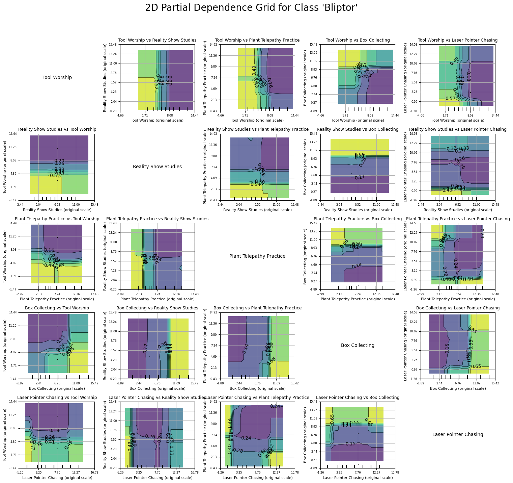

- **Tool Worship vs Reality Show Studies**:  
  Bliptor probability is highest when Tool Worship is low and Reality Show Studies are moderate (~5–7).

- **Tool Worship vs Plant Telepathy Practice**:  
  Low Tool Worship and moderate Plant Telepathy Practice jointly favor Bliptor prediction.

- **Tool Worship vs Box Collecting**:  
  Low Tool Worship combined with high Box Collecting significantly increases the probability of Bliptor.

- **Reality Show Studies vs Box Collecting**:  
  High Box Collecting can compensate for moderate Reality Show Studies to maintain high Bliptor probability.

- **Plant Telepathy Practice vs Box Collecting**:  
  High Box Collecting combined with moderate Plant Telepathy Practice strengthens Bliptor classification.

- **Laser Pointer Chasing vs Box Collecting**:  
  Moderate Laser Pointer Chasing and high Box Collecting produce strong Bliptor predictions.

> **Conclusion**:  
> Bliptor predictions are strongest when instances show **high Box Collecting**, **moderate Plant Telepathy Practice**, and **low to moderate Tool Worship**,  
> with Laser Pointer Chasing and Reality Show Studies playing secondary supportive roles.

## Bliptor Class Summary Profile

### 1. Most Influential Features and Their Behavior

- **Box Collecting** is the most influential positive feature overall.
  - Bliptor probability **increases steadily** as Box Collecting rises, especially after 7.5–8.
  - Very high Box Collecting (>9) strongly favors Bliptor classification.

- **Tool Worship** is the second most important feature with negative direction.
  - Bliptor probability **decreases** when Tool Worship exceeds 6–8.
  - Low to moderate Tool Worship (<6) supports Bliptor prediction.

- **Plant Telepathy Practice** has a **moderate mixed influence**.
  - Moderate values (4–7) enhance Bliptor probability.
  - Extremely high values (>9) reduce the likelihood.

- **Laser Pointer Chasing** plays a **supportive mixed role**.
  - Moderate Laser Pointer Chasing (~4–8) increases Bliptor probability.
  - Very low (<3) or very high (>12) values weaken predictions.

- **Reality Show Studies** have a **very minor negative impact**.
  - Moderate Reality Show Studies (~4–7) slightly support Bliptor classification.
  - Very high Reality Show Studies (>8) reduce the probability.

---

### 2. Key Ranges for Main Features

| Feature | Positive Range (for Bliptor) | Negative Range (against Bliptor) |
|:---|:---|:---|
| Box Collecting | > 7.5 | < 5 |
| Tool Worship | < 6 | > 8 |
| Plant Telepathy Practice | 4–7 | > 9 |
| Laser Pointer Chasing | 4–8 | < 3 or > 12 |
| Reality Show Studies | 4–7 (minor support) | > 8 |

---

### 3. Feature Interactions

- **Box Collecting + Tool Worship**:
  - High Box Collecting and low Tool Worship maximize Bliptor probability.
  - High Tool Worship lowers the benefit of high Box Collecting.

- **Box Collecting + Plant Telepathy Practice**:
  - Moderate Plant Telepathy Practice combined with high Box Collecting strengthens Bliptor classification.

- **Laser Pointer Chasing + Box Collecting**:
  - Moderate Laser Pointer Chasing and high Box Collecting jointly favor Bliptor prediction.

- **Reality Show Studies + Box Collecting**:
  - Moderate Reality Show Studies (~5–7) and high Box Collecting together maintain high Bliptor probabilities.

---

### 4. Subgroups Inside Bliptor Class (Bliptor Profiles)

- **Collector Bliptor**:
  - **High Box Collecting**, **Moderate Tool Worship**.
  - Represents Bliptors modeled around strong hobby collection behavior.

- **Dynamic Bliptor**:
  - **High Laser Pointer Chasing**, **Moderate Plant Telepathy Practice**.
  - Active Bliptors engaged in dynamic and intellectual activities.

- **Balanced Hobbyist Bliptor**:
  - **Moderate Box Collecting**, **Moderate Laser Pointer Chasing**, **Low Reality Show Studies**.
  - Balanced engagement across multiple hobbies without extreme specialization.

> **Overall Insight**:
> - Bliptor classification is **primarily driven by high Box Collecting**, moderated by **low to moderate Tool Worship**.  
> - **Moderate Plant Telepathy Practice** and **moderate Laser Pointer Chasing** provide additional support.  
> - Multiple **Bliptor behavior strategies** coexist depending on the balance between collection habits, physical activities, and intellectual engagement.

---

# Quorvian

## Key Features from SHAP

- **Box Collecting** is the strongest feature for predicting Quorvian.
  - It shows the highest mean SHAP value across all analyses.
- **Plant Telepathy Practice** is the second most influential feature.
  - It consistently contributes to Quorvian prediction.
- **Tool Worship** also has a notable positive influence.
  - However, it is generally less impactful than Box Collecting and Plant Telepathy Practice.
- **Reality Show Studies** and **Laser Pointer Chasing** play minor roles.
  - Reality Show Studies shows variable behavior across individuals but remains a weaker feature overall.
  - Laser Pointer Chasing has a small effect but low overall importance.

> **Insight**: Quorvian classification is **primarily driven by high Box Collecting and Plant Telepathy Practice engagement**, with secondary support from Tool Worship.

---

## Cluster-Based SHAP Analysis

The Quorvian class exhibits **heterogeneity** when analyzed by SHAP-based clustering:

- **Across 2 Clusters**:
  - **Box Collecting** dominates both clusters but slightly higher in Cluster 0.
  - **Plant Telepathy Practice** and **Tool Worship** have moderate, consistent importance across both clusters.

- **Across 3 Clusters**:
  - **Cluster 2** shows a noticeable reduction in Box Collecting influence compared to others.
  - **Plant Telepathy Practice** importance slightly increases in this cluster.

- **Across 4 Clusters**:
  - **Cluster 2** again shows **higher Plant Telepathy Practice** importance relative to other clusters.
  - Some variability emerges for Laser Pointer Chasing and Reality Show Studies across clusters.

- **Across 5 Clusters**:
  - **Box Collecting** remains the top feature across all clusters but varies slightly in dominance.
  - **Plant Telepathy Practice** importance peaks for certain clusters (e.g., Cluster 2 and Cluster 4).
  - Minor features like Laser Pointer Chasing show small fluctuations across subgroups.

> **Summary**:  
> **Box Collecting** remains the fundamental predictor for Quorvian across all clusters.  
> **Plant Telepathy Practice** importance varies across subgroups, suggesting some Quorvians are modeled more through telepathic activities rather than physical Box Collecting.  
> **Tool Worship** consistently acts as a secondary feature with stable but moderate impact.

---

### SHAP Values for Subgroups within the Quorvian Class

| Plot | Number of Subgroups (KMeans) in Quorvian Class |
|:----:|:--------------------------------------------:|
| 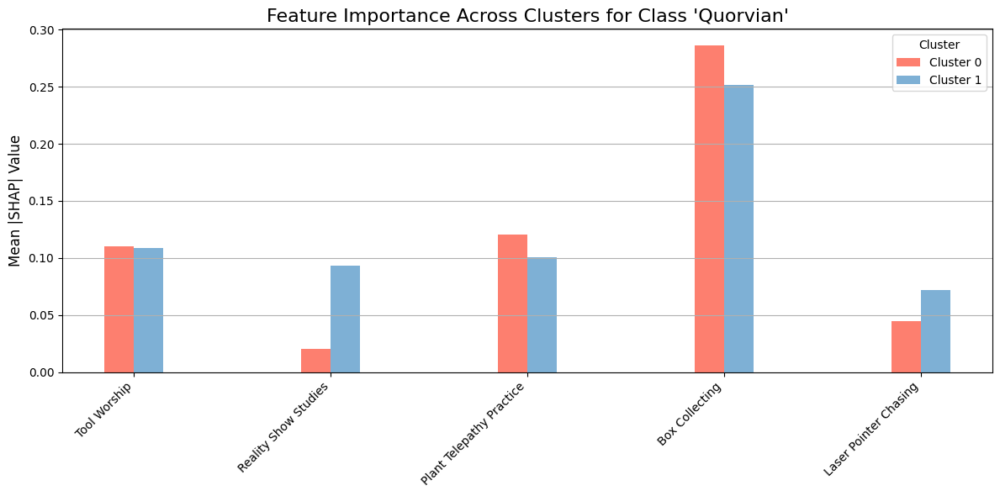 | 2 subgroups |
| 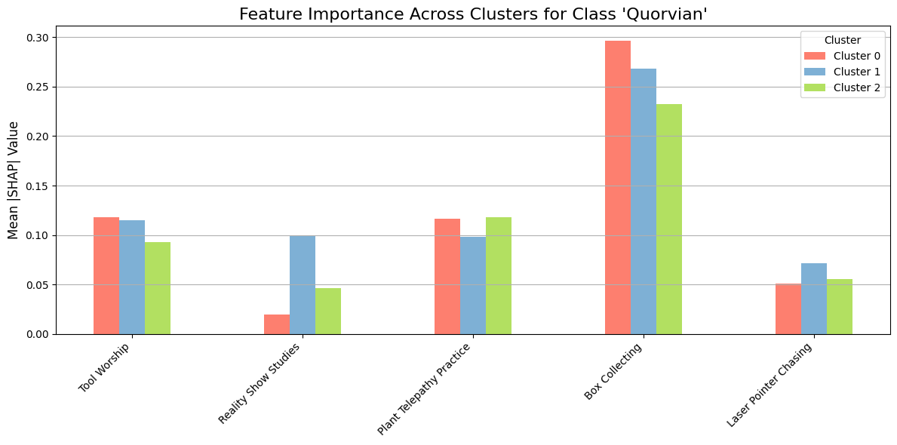 | 3 subgroups |
| 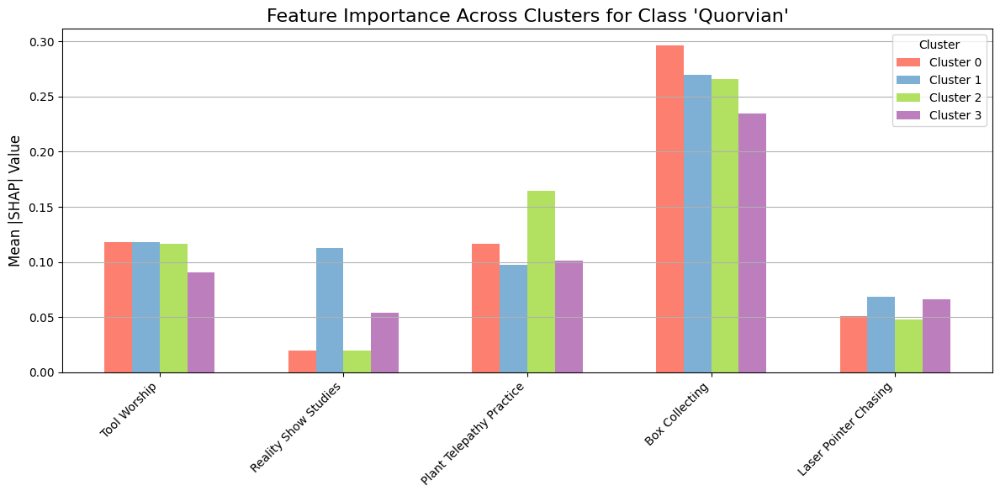 | 4 subgroups |
|  | 5 subgroups |

---

## Anchor Explanations

| Anchor | Conditions | Precision | Coverage |
|:------:|:-----------|:---------:|:--------:|
| 1 | `Laser Pointer Chasing > 8.98`, `Plant Telepathy Practice > 3.00` | 1.000 | 4.08% |
| 2 | `Plant Telepathy Practice > 10.01`, `Laser Pointer Chasing > 2.98`, `Reality Show Studies <= 3.99` | 0.969 | 2.75% |
| 3 | `Laser Pointer Chasing > 6.99`, `Plant Telepathy Practice > 10.01`, `Box Collecting <= 9.01`, `Reality Show Studies <= 3.99` | 1.000 | 0.72% |

#### Interpretation

- **Anchor 1**:
  - Quorvians with high Laser Pointer Chasing (>8.98) and moderate to high Plant Telepathy Practice (>3.00) are predicted with perfect precision.
- **Anchor 2**:
  - Very high Plant Telepathy Practice (>10.01) and moderately high Laser Pointer Chasing combined with low Reality Show Studies predict Quorvian with 96.89% precision.
- **Anchor 3**:
  - A more specific and complex rule achieving 100% precision but covering a smaller portion of Quorvians (0.72%).

> **Conclusion**: Quorvian prediction relies heavily on patterns of high Plant Telepathy Practice combined with active Laser Pointer Chasing, often supported by low Reality Show Studies engagement.

---

## Tree Extraction and Impact Analysis

### Approach

- Extracted decision rules from individual trees in the Random Forest.
- Focused on paths leading to the Quorvian class.
- Selected short, interpretable trees (2–4 conditions) for visualization.
- Built full decision tree diagrams to show key splits, real class predictions (Quorvian, Bliptor, Zarnak), and all branches.

---

### Impact on Analysis

| Aspect | Impact |
|:------|:-------|
| **Understanding Key Features** | Highlighted Plant Telepathy Practice, Laser Pointer Chasing, Box Collecting, and Reality Show Studies as important features. |
| **Finding Important Thresholds** | Revealed important splits (e.g., Plant Telepathy Practice > 10.0, Laser Pointer Chasing > 6.0, Reality Show Studies <= 5.0). |
| **Identifying Feature Interactions** | Showed that specific feature combinations, especially involving Plant Telepathy and Laser Pointer Chasing, drive Quorvian predictions. |
| **Recognizing Heterogeneity** | Different paths reflect multiple types of Quorvian profiles based on hobby intensities and feature interactions. |

---

### General Behavior of Quorvian Class

- **Heterogeneous Decision Patterns**:  
  Quorvian predictions emerge from specific combinations of **high Plant Telepathy Practice**, **moderate to high Laser Pointer Chasing**, and **low Reality Show Studies**.

- **Plant Telepathy Practice** is the strongest positive indicator — Quorvians typically have high or moderate engagement.
- **Laser Pointer Chasing** contributes as a supportive secondary feature — moderate to high chasing increases Quorvian probability in combination with telepathy practice.
- **Reality Show Studies** acts as a suppressor — low Reality Show Studies scores favor Quorvian predictions over other classes.
- **Box Collecting** appears in mixed profiles, differentiating Quorvians from Bliptors when combined with telepathy and reality show behaviors.

> **Conclusion**: Quorvian classification is primarily driven by **strong intellectual engagement (Plant Telepathy Practice)** combined with **lower media consumption (Reality Show Studies)** and **moderate physical engagement (Laser Pointer Chasing)**.

---

### Quorvian Profile Selection and Visualization

#### Approach to Profile Selection

Three Quorvian profiles were selected based on real extracted decision trees to illustrate the diversity inside the Quorvian class:

| Profile | Key Features | Represents |
|:---|:---|:---|
| **Telepathy-Focused Quorvian** | High Plant Telepathy Practice, Moderate Laser Pointer Chasing | "Intellectual Explorer Quorvian" |
| **Low Reality Show Quorvian** | Moderate Plant Telepathy Practice, Low Reality Show Studies | "Focused Thinker Quorvian" |
| **Mixed Feature Quorvian** | Balanced Box Collecting, Laser Pointer Chasing, Plant Telepathy Practice | "Balanced Quorvian" |

---

#### Quorvian Profile Visualizations

| Profile | Decision Tree Visualization                                                       | Key Notes |
|:-------------------------------------------------|:----------------------------------------------------------------------------------|:---|
| **Telepathy-Focused Quorvian** | 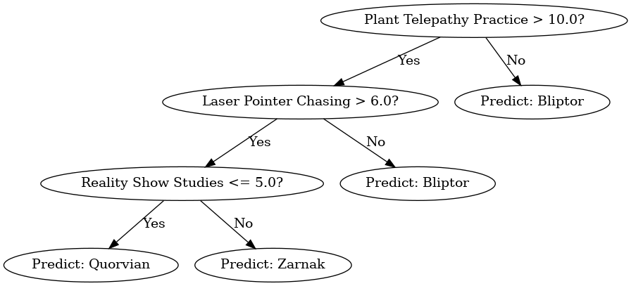 | High Plant Telepathy Practice (>10.0) and moderate Laser Pointer Chasing (>6.0) favor Quorvian prediction. |
| **Low Reality Show Quorvian** | 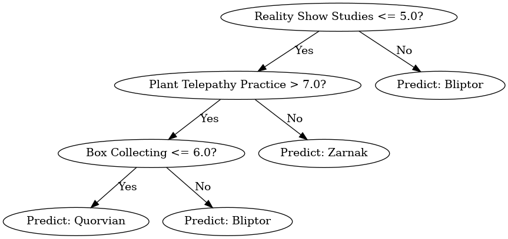   | Moderate Plant Telepathy (>7.0) and very low Reality Show Studies (<=5.0) support Quorvian predictions. |
| **Mixed Feature Quorvian** | 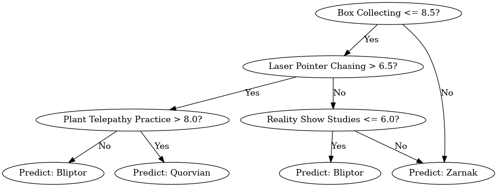         | Balanced Plant Telepathy, moderate Laser Pointer Chasing, and low Reality Show Studies contribute to Quorvian predictions in diverse profiles. |

---

### PDP (1D and 2D) Analysis for Quorvian Class

Partial Dependence Plots (PDP) and Individual Conditional Expectation (ICE) plots provide further insight into **how individual features influence the probability of predicting Quorvian**.

#### 1D PDP + ICE Observations

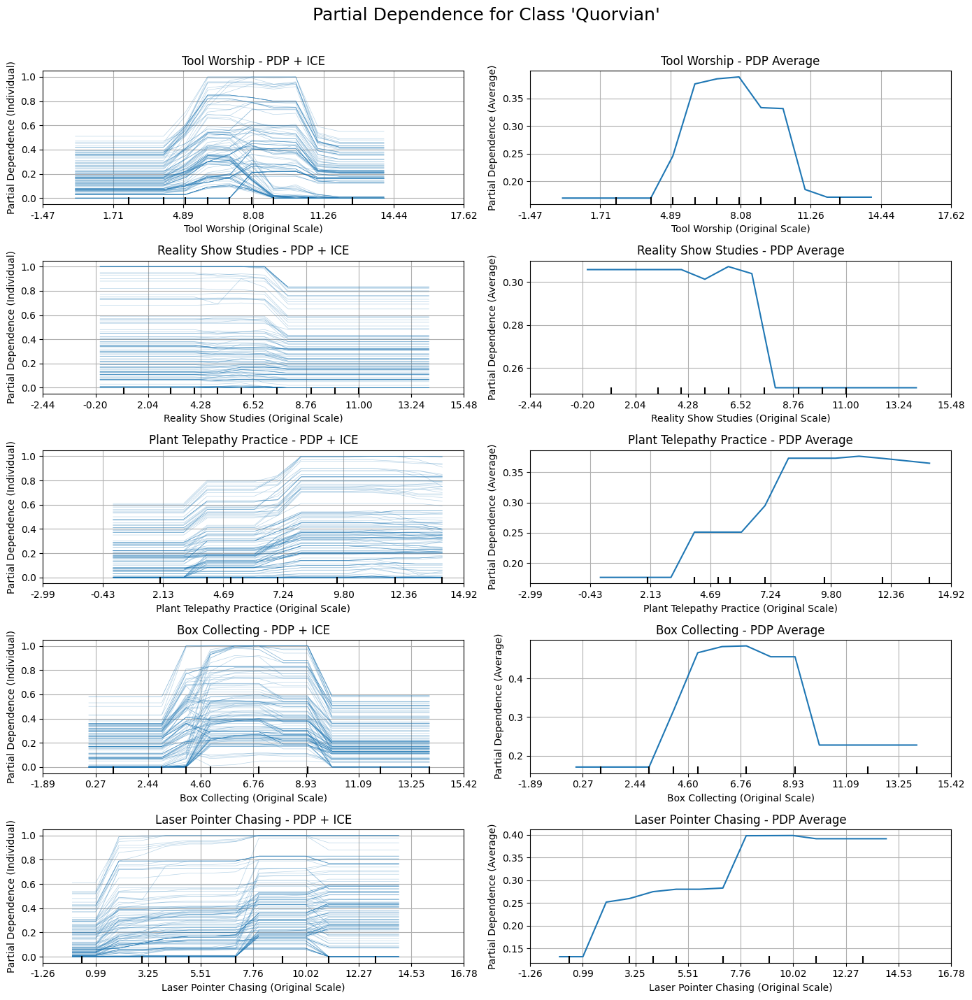

- **Tool Worship**:  
  Probability of Quorvian prediction increases sharply between 5–9 on the Tool Worship scale.  
  Very high Tool Worship (>10) slightly reduces prediction probability.

- **Reality Show Studies**:  
  Moderate Reality Show Studies values (4–7) slightly favor Quorvian prediction.  
  Very high values (>8) lead to a notable drop in Quorvian probability.

- **Plant Telepathy Practice**:  
  Higher Plant Telepathy Practice (>7) steadily increases the probability of Quorvian classification.  
  Peak contribution is seen around 8–10.

- **Box Collecting**:  
  Moderate Box Collecting (5–9) supports Quorvian prediction.  
  Extremely high Box Collecting (>10) decreases the probability slightly.

- **Laser Pointer Chasing**:  
  Moderate Laser Pointer Chasing (4–8) positively influences Quorvian probability.  
  Very low (<3) or very high (>12) values slightly weaken prediction.

> **Insight**: High Plant Telepathy Practice, moderate Box Collecting, and moderate Laser Pointer Chasing are strong signals for Quorvian classification.

---

#### 2D PDP Observations

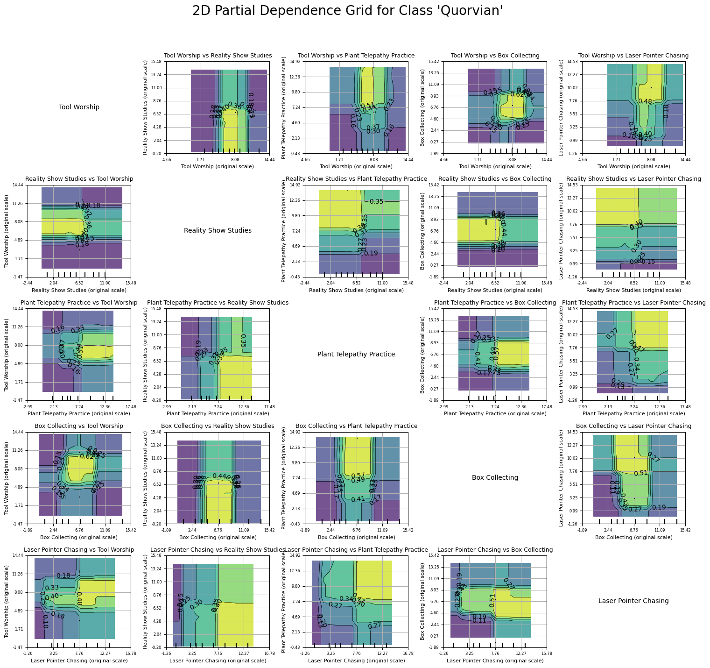

- **Tool Worship vs Reality Show Studies**:  
  Quorvian probability is highest when Tool Worship is moderately high (7–9) and Reality Show Studies are low to moderate (~4–7).

- **Tool Worship vs Plant Telepathy Practice**:  
  Higher Plant Telepathy Practice (>7) combined with moderate Tool Worship significantly boosts Quorvian probability.

- **Reality Show Studies vs Plant Telepathy Practice**:  
  Low Reality Show Studies and high Plant Telepathy Practice jointly favor Quorvian prediction.

- **Box Collecting vs Plant Telepathy Practice**:  
  Moderate Box Collecting (5–9) and high Plant Telepathy Practice (>8) together strengthen Quorvian predictions.

- **Laser Pointer Chasing vs Box Collecting**:  
  Moderate Laser Pointer Chasing combined with moderate Box Collecting favors Quorvian classification.

> **Conclusion**:  
> Quorvian predictions are strongest when instances show **high Plant Telepathy Practice**,  
> **moderate Box Collecting**, and **moderate Laser Pointer Chasing**,  
> especially when combined with **moderate Tool Worship** and **lower Reality Show Studies**.

## Quorvian Class Summary Profile

### 1. Most Influential Features and Their Behavior

- **Box Collecting** is the most influential mixed feature overall.
  - Quorvian probability **increases** with moderate Box Collecting (5–9).
  - Extremely high Box Collecting (>10) slightly reduces the probability.

- **Plant Telepathy Practice** is the second strongest feature with positive effect.
  - Higher Plant Telepathy Practice (>7) steadily **raises** the probability of Quorvian prediction.
  - Peak contribution observed around 8–10.

- **Tool Worship** has a moderate mixed influence.
  - Probability of Quorvian prediction **rises sharply** between 5–9 on the Tool Worship scale.
  - Very high Tool Worship (>10) slightly decreases prediction.

- **Laser Pointer Chasing** plays a **minor but mixed role**.
  - Moderate Laser Pointer Chasing (4–8) slightly improves Quorvian predictions.
  - Very low (<3) or very high (>12) values weaken prediction.

- **Reality Show Studies** act as a **weak negative role**.
  - Moderate Reality Show Studies (4–7) slightly favor Quorvian prediction.
  - Very high Reality Show Studies (>8) sharply decrease probability.

---

### 2. Key Ranges for Main Features

| Feature | Positive Range (for Quorvian) | Negative Range (against Quorvian) |
|:---|:---|:---|
| Box Collecting | 5–9 | > 10 |
| Plant Telepathy Practice | > 7 | < 5 |
| Tool Worship | 5–9 | > 10 |
| Laser Pointer Chasing | 4–8 | < 3 or > 12 |
| Reality Show Studies | 4–7 (minor support) | > 8 |

---

### 3. Feature Interactions

- **Plant Telepathy Practice + Box Collecting**:
  - Moderate Box Collecting combined with high Plant Telepathy Practice maximizes Quorvian probability.

- **Tool Worship + Reality Show Studies**:
  - Moderate Tool Worship with low Reality Show Studies strongly favors Quorvian predictions.

- **Plant Telepathy Practice + Laser Pointer Chasing**:
  - Moderate Laser Pointer Chasing and high Plant Telepathy Practice jointly enhance Quorvian classification.

- **Reality Show Studies + Plant Telepathy Practice**:
  - Low Reality Show Studies and high Plant Telepathy Practice significantly boost Quorvian prediction.

---

### 4. Subgroups Inside Quorvian Class (Quorvian Profiles)

- **Intellectual Explorer Quorvian**:
  - **High Plant Telepathy Practice**, **Moderate Laser Pointer Chasing**.
  - Represents Quorvians driven by telepathic and dynamic intellectual activities.

- **Focused Thinker Quorvian**:
  - **Moderate Plant Telepathy Practice**, **Low Reality Show Studies**.
  - Focused and less distracted by media, emphasizing mental activities.

- **Balanced Quorvian**:
  - **Balanced Box Collecting**, **Moderate Laser Pointer Chasing**, **Moderate Plant Telepathy Practice**.
  - A more balanced profile mixing physical collection hobbies with intellectual pursuits.

> **Overall Insight**:
> - Quorvian classification is **primarily driven by high Plant Telepathy Practice** and **moderate Box Collecting**.  
> - **Tool Worship**, **Laser Pointer Chasing**, and **low Reality Show Studies** act as supportive secondary features.  
> - Multiple **Quorvian behavioral profiles** coexist, depending on engagement in telepathic, collecting, and dynamic activities.

---
