# Class Profiles Based on XAI Analysis

# Table of Contents
- [Model and Dataset](#model-and-dataset)
- [Explanation Methods Used](#explanation-methods-used)
- [Short Note on Analysis Goals and Terminology](#short-note-on-analysis-goals-and-terminology)
- [Global Shapley Values for All Classes](#global-shapley-values-for-all-classes)
- [Dog](#dog)
  - [Key Features from SHAP](#key-features-from-shap)
  - [Cluster-Based SHAP Analysis](#cluster-based-analysis)
  - [Anchor Explanations](#anchor-explanations)
  - [Tree Extraction and Impact Analysis](#tree-extraction-and-impact-analysis)
  - [Dog Profile Selection and Visualization](#dog-profile-selection-and-visualization)
  - [PDP (1D and 2D) Analysis for Dog Class](#pdp-1d-and-2d-analysis-for-dog-class)
  - [Dog Class Summary Profile](#dog-class-summary-profile)
- [Duck](#duck)
  - [Key Features from SHAP](#key-features-from-shap-1)
  - [Cluster-Based SHAP Analysis](#cluster-based-shap-analysis)
  - [Anchor Explanations](#anchor-explanations-1)
  - [Tree Extraction and Impact Analysis](#tree-extraction-and-impact-analysis-1)
  - [Duck Profile Selection and Visualization](#duck-profile-selection-and-visualization)
  - [PDP (1D and 2D) Analysis for Duck Class](#pdp-1d-and-2d-analysis-for-duck-class)
  - [Duck Class Summary Profile](#duck-class-summary-profile)
- [Cat](#cat)
  - [Key Features from SHAP](#key-features-from-shap-2)
  - [Cluster-Based SHAP Analysis](#cluster-based-shap-analysis-1)
  - [Anchor Explanations](#anchor-explanations-2)
  - [Tree Extraction and Impact Analysis](#tree-extraction-and-impact-analysis-2)
  - [Cat Profile Selection and Visualization](#cat-profile-selection-and-visualization)
  - [PDP (1D and 2D) Analysis for Cat Class](#pdp-1d-and-2d-analysis-for-cat-class)
  - [Cat Class Summary Profile](#cat-class-summary-profile)

---
## Model and Dataset

- **Model**: Random Forest Classifier
- **Dataset**: Animal Hobbies Dataset (synthetic)
- **Classes**: 
  - Dog
  - Duck
  - Cat
- **Features** (measured in hours per week, scale 0–14):
  - Running
  - Swimming
  - Detective Stories
  - Art
  - Gardening

**Dataset Description**:  
The Animal Hobbies Dataset simulates weekly hobby engagement patterns among three distinct animal classes. Each data instance represents an individual animal's involvement across five activities, reflecting different behavioral tendencies such as physical activity, creativity, and cognitive engagement. Although synthetic, the dataset captures complex, nonlinear relationships between features and class labels, making it suitable for detailed model interpretation through Explainable AI (XAI) methods.

---

## Explanation Methods Used

To understand how the Random Forest model predicts each animal class, a comprehensive set of explanation techniques was applied:

- **SHAP (SHapley Additive exPlanations)**:
  - Provided global feature importance rankings across all classes.
  - Supported cluster-based subgroup analysis within each class to reveal internal heterogeneity.

- **Anchors**:
  - Generated local high-precision rules capturing specific feature combinations associated with a particular class.

- **Tree Rule Extraction**:
  - Extracted decision paths from individual Random Forest trees.
  - Focused on short, interpretable paths (2–4 conditions) to uncover dominant decision logic.

- **Partial Dependence Plots (PDP) and Individual Conditional Expectation (ICE) Plots**:
  - Visualized how individual features (1D) and feature pairs (2D) affect class prediction probabilities.
  - Helped reveal main effects and interactions between features.

**Goal**:  
Provide a multi-level understanding of the Random Forest’s behavior by combining global, local, and feature interaction insights.  
Identify key factors that drive class predictions, characterize feature importance directions and ranges, and uncover distinct behavioral subgroups within each animal class.

---

## Short Note on Analysis Goals and Terminology

In this analysis, we aim to construct **class profiles** for the **Random Forest (RF)** model.  
Our focus is on five aspects:
- **Feature importance**,
- **Direction of feature influence**,
- **Characteristic feature ranges**,
- **Impactful feature interactions**,
- **Distinct profiles (subgroups)** within each class.

When describing the **direction of importance**, we refer to the effect a feature has on the prediction, without implying the strength (magnitude).

Specifically:
- A **positive direction/impact** means that **higher feature values increase the probability of predicting the target class**.
- A **negative direction/impact** means that **lower feature values increase the probability of predicting the target class**.
- A **mixed impact** means that **higher feature values can both increase and decrease the probability depending on the feature values**.

For describing feature value ranges, we adopt the following convention:

- **Low range**: 0–5
- **Moderate range**: 5–10
- **High range**: 10–14

## Global Shapley Values for all classes

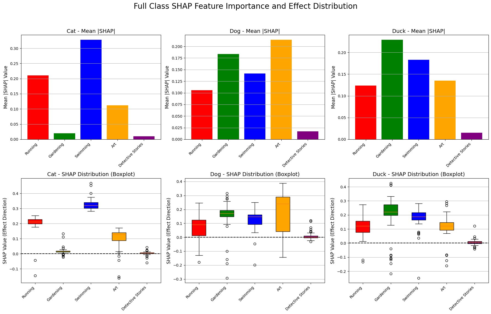

---

# Class: Dog

---

## Key Features from SHAP

- **Art** and **Gardening** show the highest SHAP contributions for predicting Dog.
- **Running** and **Swimming** also contribute positively, though with less intensity compared to Art and Gardening.
- **Detective Stories** has a minor but consistent role, generally negative or neutral in effect.

---

## Cluster-Based Analysis

- Different **subgroups of Dogs** rely on **slightly different features**:
  - Some clusters prioritize **Art** more heavily.
  - Others emphasize **Gardening** or **Running**.
- This suggests a clear **heterogeneity** inside the "Dog" class: not all Dogs are the same type according to the model.
- **Cluster 2** (in both 3-cluster and 5-cluster setups) shows a **very high reliance on Art**.
- Clusters with **lower Running importance** still achieve high Dog predictions, hinting at **multiple decision paths** inside the Random Forest model.
- For one cluster (**4 and 5 cluster setups**) **Detective Stories** and **Art** have higher values compared to other clusters.

---

### SHAP Values for Subgroups within the Dog Class

| Plot | Number of Subgroups (KMeans) in Dog Class |
|:----:|:------------------------------------------:|
| 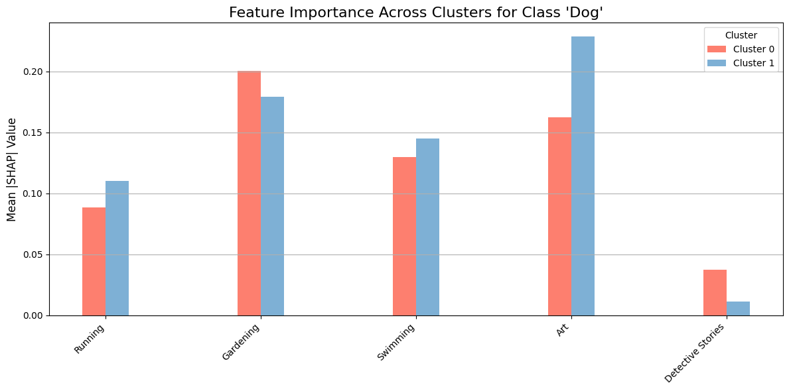 | 2 subgroups |
| 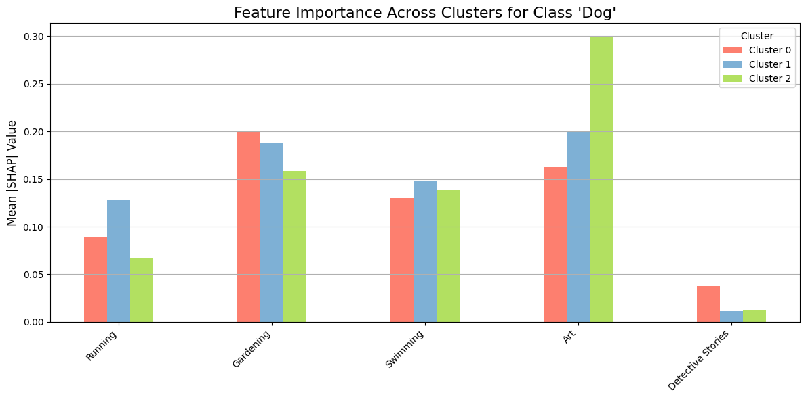 | 3 subgroups |
| 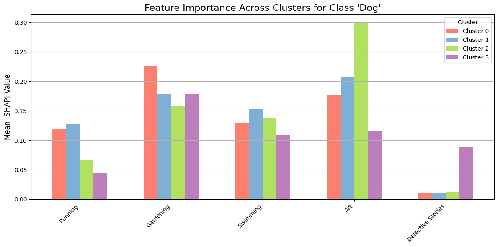 | 4 subgroups |
| 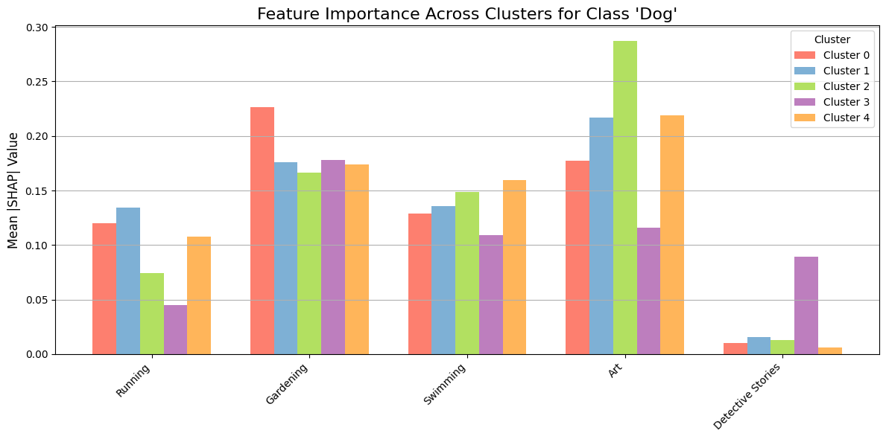 | 5 subgroups |

---

## Anchor Explanations

Anchors identify **feature conditions** under which the model predicts Dog with high precision.

| Anchor | Conditions | Precision | Coverage |
|:------:|:-----------|:---------:|:--------:|
| 1 | `Gardening > 9.01`, `Art <= 7.98`, `Running > 6.99` | 0.972 | 9.52% |
| 2 | `Gardening > 5.00`, `Art <= 4.02` | 0.957 | 19.56% |
| 3 (non-eligible, lower precision) | `Gardening > 2.27`, `Art <= 7.98`, `Running > 6.99`, `Detective Stories <= 11.00` | 0.904 | 13.49% |

---

### Interpretation

- **Anchor 1**:
  - Dogs with very high Gardening (>9.01), low Art (<=7.98), and high Running (>6.99) are predicted with 97.2% precision.
  - This anchor covers around 9.5% of Dog instances.

- **Anchor 2**:
  - A simpler rule based on moderately high Gardening (>5.00) and very low Art (<=4.02).
  - Maintains a high precision of 95.7% while covering a larger part of the Dog population (19.6%).

- **Anchor 3**:
  - A more complex rule involving Gardening, Art, Running, and Detective Stories.
  - Precision is slightly lower (90.4%) and thus it does not satisfy the initial precision constraint.
  - This rule explains about 13.5% of Dog predictions.

---

### Conclusion

- Dog predictions are primarily anchored by high Gardening and low Art values.
- High Running strengthens Dog prediction, particularly in more active profiles.
- Detective Stories plays a minor role in some complex subgroups.
- Anchors reveal that Dogs can be captured with relatively simple Gardening and Art rules, but additional features like Running and Detective Stories help explain more nuanced clusters of Dogs.

---

## Tree Extraction and Impact Analysis

### Approach

- Extracted decision rules from individual trees in the Random Forest.
- Focused on paths leading to the Dog class.
- Selected short, interpretable paths (2–4 conditions) for visualization.
- Built simple decision tree diagrams to show key splits and decisions.

---

### Impact on Analysis

| Aspect | Impact |
|:------|:-------|
| **Understanding Key Features** | Highlighted Gardening, Art, and Running as dominant features. |
| **Finding Important Thresholds** | Revealed critical decision splits (e.g., Gardening > 6.5). |
| **Identifying Feature Interactions** | Showed that combinations, not individual features, drive predictions. |
| **Recognizing Heterogeneity** | Different thresholds across trees indicated diverse decision paths for Dog. |

> **Note**: Tree visualization helped bridge the gap between global feature importance and local decision logic, providing a more complete understanding of how the Random Forest predicts the Dog class.

---

### General Behavior of Dog Class

- **Heterogeneous Decision Patterns**: Dog is not defined by one feature. Multiple combinations of hobbies lead to Dog predictions.
- **Gardening** is the most stable positive indicator.
- **Running** strengthens predictions in active Dogs.
- **Low Art** typically favors Dog over Cat.
- **Swimming** and **Detective Stories** are supportive but secondary.

> **Conclusion**: Dog classification involves **complex feature interactions**, not simple thresholds.

---

### Dog Profile Selection and Visualization

#### Approach to Profile Selection

We selected three Dog profiles to illustrate the variety inside the Dog class:

| Profile | Key Features | Represents |
|:---|:---|:---|
| **Gardening & Art Driven Dog** | High Gardening, Low Art | "Outdoor/Nature Dog" |
| **Swimming & Running Driven Dog** | High Swimming, High Running, Medium Gardening | "Athletic Dog" |
| **Swimming & Detective Stories Driven Dog** | Low Swimming, Low Detective Stories, Low Art | "Quiet/Thinking Dog" |

---

#### Dog Profile Visualizations

| Profile | Decision Tree Visualization | Key Notes |
|:---|:---|:---|
| **Gardening & Art Driven Dog** | 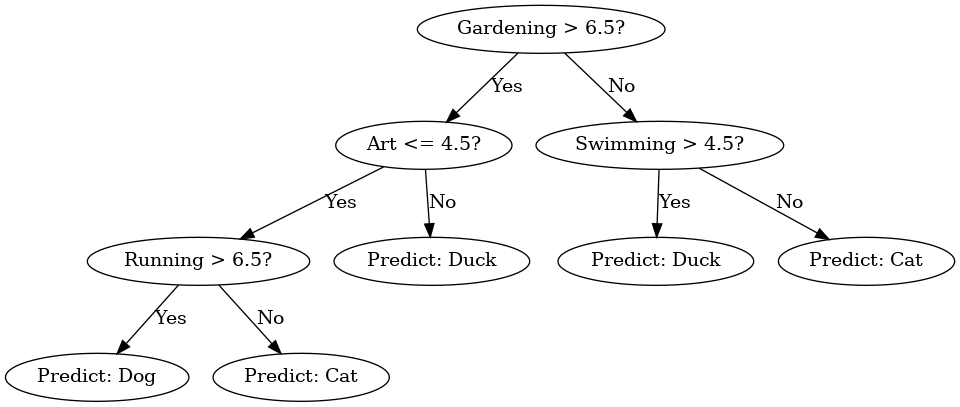 | High Gardening (>6.5) and low Art (≤4.5) lead to Dog. Running >6.5 reinforces Dog prediction. |
| **Swimming & Running Driven Dog** | 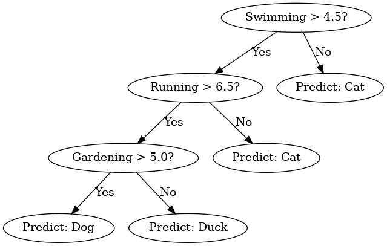 | High Swimming (>4.5) and high Running (>6.5) favor Dog. Gardening >5.0 confirms Dog prediction. |
| **Swimming & Detective Stories Driven Dog** | 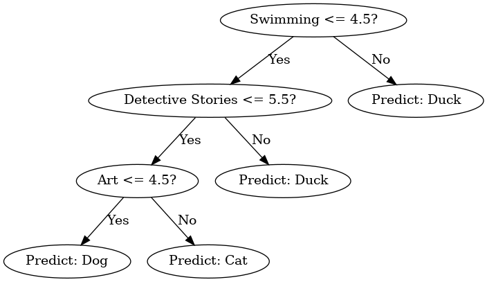 | Low Swimming (≤4.5), low Detective Stories (≤5.5), and low Art (≤4.5) lead to Dog. Different type of Dog compared to high activity Dogs. |

---

### PDP (1D and 2D) Analysis for Dog Class

Partial Dependence Plots (PDP) and Individual Conditional Expectation (ICE) plots provide further insight into **how individual features influence the probability of predicting Dog**.

#### 1D PDP + ICE Observations

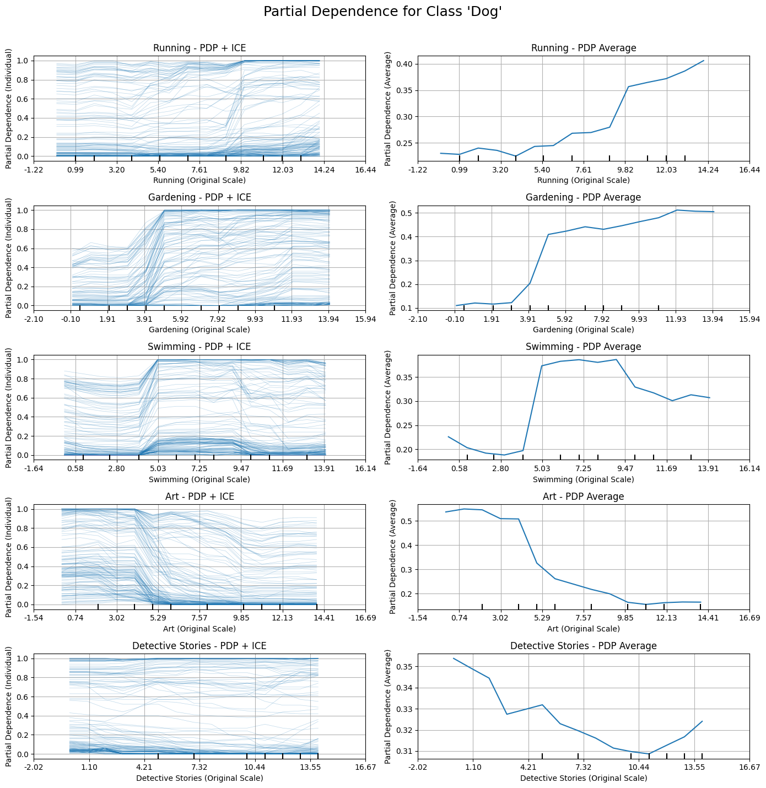

- **Running**: Probability of Dog prediction increases sharply after ~6–7 on the Running scale.
- **Gardening**: Probability rises rapidly when Gardening exceeds ~5, reaching a plateau beyond 8–10.
- **Swimming**: Shows a non-monotonic pattern — moderate Swimming (~6–9) favors Dog, very high Swimming reduces probability slightly.
- **Art**: Higher Art scores **decrease** Dog probability continuously.
- **Detective Stories**: Probability **decreases** with more interest in Detective Stories, especially after ~5.

>  **Insight**: Gardening and Running have strong positive effects on Dog prediction. Art has a strong negative influence.

---

#### 2D PDP Observations

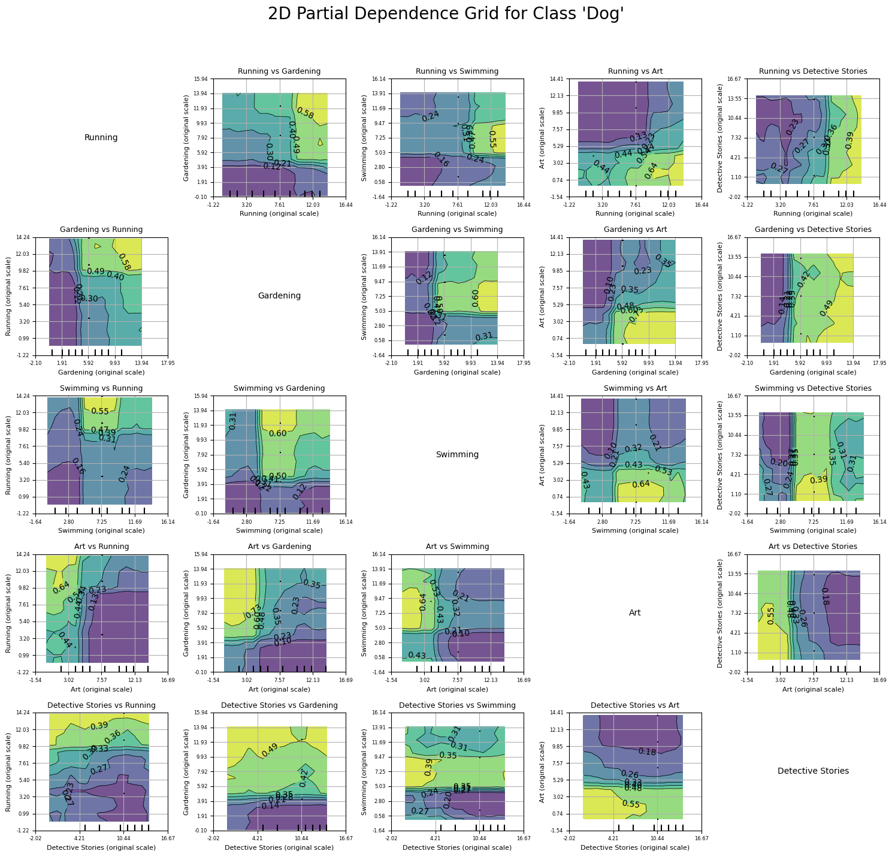

- **Gardening vs Running**: The strongest Dog probability appears when both Gardening and Running are high.
- **Gardening vs Art**: High Gardening and low Art yield high Dog prediction.
- **Swimming interactions**: Moderate Swimming combined with high Gardening or high Running also supports Dog prediction.
- **Detective Stories interactions**: High Detective Stories consistently decrease Dog probability when combined with any other feature.

## Dog Class Summary Profile

#### 1. Most Influential Features and Their Behavior

- **Gardening** is the most influential feature overall.  
  - Dog probability **rises sharply** when Gardening exceeds **5–6** (on original scale).
  - Reaches near-saturation beyond **8–10**.

- **Running** is the second most influential positive feature.
  - **Strong positive contribution** starting from **6–7**.
  - The effect strengthens even further when combined with high Gardening.

- **Art** has a **strong negative influence**.
  - Dog probability **decreases steadily** with higher Art interest.
  - Dogs are more likely when **Art is low (<6)**.

- **Swimming** has a **mixed effect**.
  - Moderate Swimming (~6–9) supports Dog classification.
  - Very high Swimming (>12) slightly reduces Dog probability.

- **Detective Stories** also **negatively influence** Dog prediction.
  - Higher interest in Detective Stories (>5) lowers Dog probability significantly.

---

#### 2. Key Ranges for Main Features

| Feature | Positive Range (for Dog) | Negative Range (against Dog) |
|:---|:---|:---|
| Gardening | > 5–6 | < 4 |
| Running | > 6–7 | < 5 |
| Art | < 6 | > 8 |
| Swimming | 6–9 (moderate) | Very high (>12) or very low (<4) |
| Detective Stories | < 5 | > 5 |

---

#### 3. Feature Interactions

- **Gardening + Running**:  
  - Dog probability is **maximal** when both Gardening and Running are high.
  - These two features interact **additively**, meaning their effects strengthen each other.

- **Gardening + Art**:  
  - **High Gardening + Low Art** is a typical Dog pattern.
  - If Art is high even when Gardening is high, Dog probability drops.

- **Swimming interactions**:  
  - Moderate Swimming values combined with high Running or Gardening **enhance Dog prediction**.
  - However, Swimming alone without support from Gardening or Running is weaker.

- **Detective Stories interactions**:  
  - Acts as a **suppressor**: high Detective Stories generally reduce Dog probability, even when other features are favorable.

---

#### 4. Subgroups Inside Dog Class (Dog Profiles)

- **Outdoor/Nature Dog**:
  - **High Gardening**, **Low Art**
  - Moderate Running supports but is not critical.
  - Represents dogs that are modeled more around outdoor activities.

- **Athletic/Active Dog**:
  - **High Running**, **High Swimming**, **Medium-High Gardening**.
  - Very physically active dogs modeled by the system.

- **Quiet/Thinking Dog**:
  - **Low Swimming**, **Low Detective Stories**, **Low Art**.
  - Less active hobby profile but still classified as Dog based on lower engagement in Detective Stories and Art.

>  **Overall Insight**:
> - Dog classification emerges from **specific combinations** of features — no single feature explains it completely.
> - **Gardening and Running** drive the positive prediction core.
> - **Art** and **Detective Stories** act as negative conditions.
> - Multiple **decision strategies** (profiles) coexist in the model to predict Dogs based on different hobby patterns.

---
# Duck

##  Key Features from SHAP
- **Gardening** is the strongest feature for predicting Duck.
  - It has the highest mean SHAP value for Duck class across all methods (barplots and boxplots).
- **Swimming** is the second strongest feature.
  - Consistently positive influence, slightly lower than Gardening but very important.
- **Running** contributes moderately to Duck prediction.
  - Moderate effect but smaller impact compared to Gardening and Swimming.
- **Art** plays a moderate role.
  - Positive for some Ducks, but less important than Gardening and Swimming.
- **Detective Stories** has a small or slightly negative influence.

>  **Insight**: Duck classification is **mostly driven by Gardening and Swimming interest**, with minor support from Running and Art.

## Cluster-Based SHAP Analysis

- Across clusters, **Gardening** remains dominant, but **Swimming** importance sometimes slightly overtakes Gardening in specific clusters.
- **Running** varies more significantly across clusters:
  - Some clusters have Ducks with very active profiles (higher Running importance).
  - Some Ducks show relatively low Running importance but are predicted based on Swimming and Gardening.
- **Art** and **Detective Stories** show relatively low variation across clusters — minor features.

---

| Plot | Description |
|:---|:---|
| 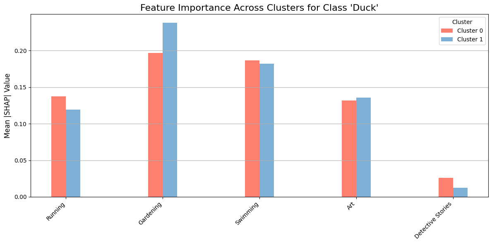 | Feature importance across 2 Duck subgroups (KMeans). |
| 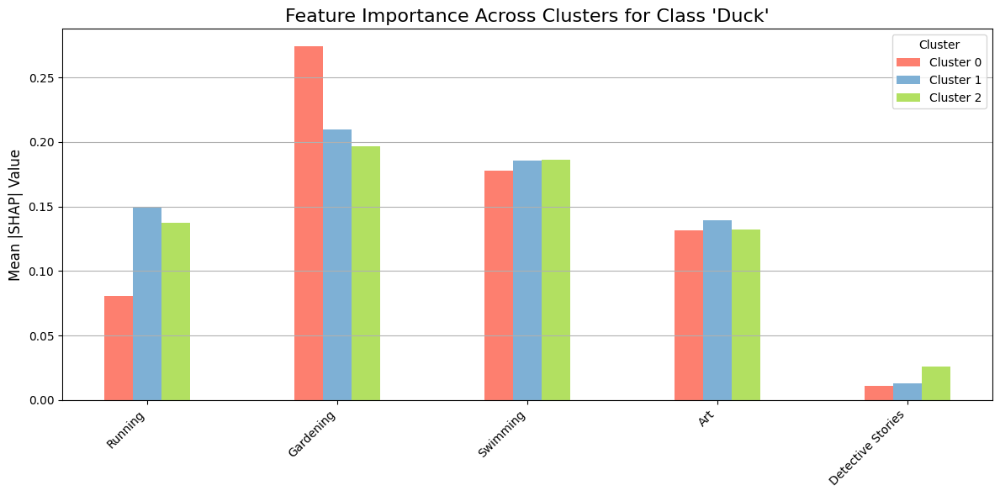 | Feature importance across 3 Duck subgroups. |
| 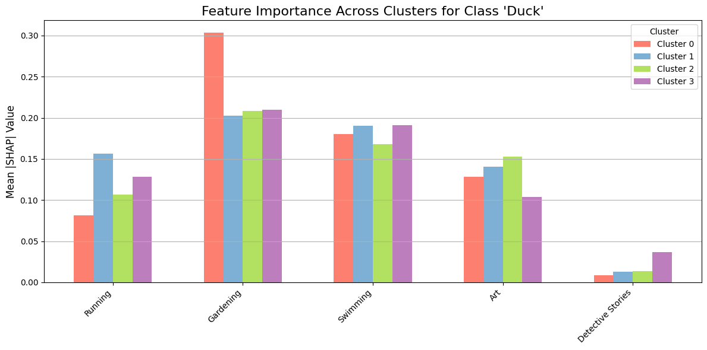 | Feature importance across 4 Duck subgroups. |
| 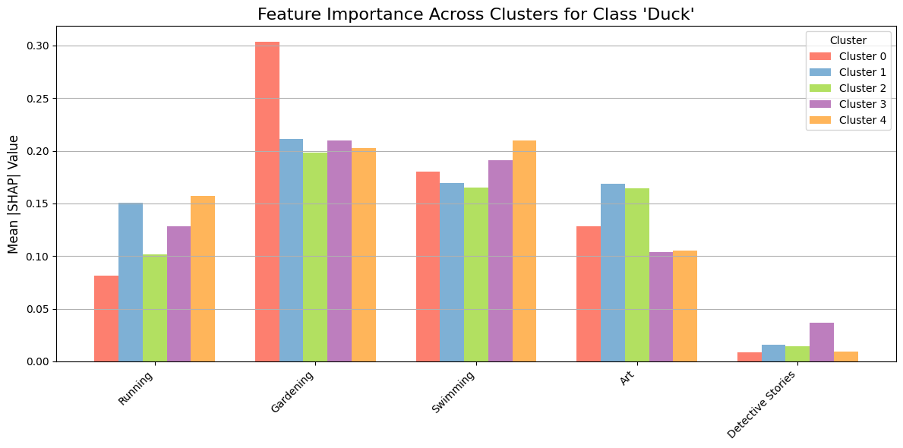 | Feature importance across 5 Duck subgroups. |

---

### Summary of SHAP Analysis for Duck:

- **Gardening > Swimming > Running** hierarchy overall.
- Subgroups show that some Ducks are more **Swimming-based** while others are **Gardening-based**.
- **Running** importance varies the most between Ducks.
- **Detective Stories** mostly act as a very minor suppressor.

---
## Anchor Explanations

Anchors identify **feature conditions** under which the model predicts Duck with high precision.

| Anchor | Conditions | Precision | Coverage |
|:------:|:-----------|:---------:|:--------:|
| 1 | `Gardening <= 2.27`, `Swimming > 6.98` | 0.973 | 15.29% |
| 2 | `Gardening <= 5.00`, `Swimming > 10.76`, `Art > 7.98` | 1.000 | 7.55% |
| 3 | `Gardening <= 2.27`, `Swimming > 10.76` | 0.980 | 10.4% |

---

### Interpretation:

- **Anchor 1**:
  - Ducks with **low Gardening** (<= 2.27) and **high Swimming** (> 6.98) are predicted with **97% precision**.
  - Covers about **15%** of Duck samples — broad rule.

- **Anchor 2**:
  - Ducks with **low Gardening** (<= 5.00), **very high Swimming** (> 10.76), and **high Art** (> 7.98) are **always predicted correctly (100% precision)**.
  - Smaller coverage (7.55%) — very pure, very specific group.

- **Anchor 3**:
  - Ducks with **low Gardening** (<= 2.27) and **very high Swimming** (> 10.76) have **98% precision**.
  - Medium coverage (~10%).

---

> **Conclusion**:
> - **High Swimming** is critical to Duck prediction across all anchors.
> - **Low Gardening** is also consistently necessary.
> - **High Art** can sometimes strengthen the prediction but is not essential.
> - Duck anchors cover **different Swimming intensity profiles**, from moderately high to very high levels.

---

## Tree Extraction and Impact Analysis

### Approach

- Extracted decision rules from individual trees in the Random Forest.
- Focused on paths leading to the Duck class.
- Selected short, interpretable paths (2–4 conditions) for visualization.
- Built simple decision tree diagrams to show key splits and decisions.

---

### Impact on Analysis

| Aspect | Impact |
|:------|:-------|
| **Understanding Key Features** | Highlighted Gardening and Swimming as dominant features. |
| **Finding Important Thresholds** | Revealed critical decision splits (e.g., Gardening ≤ 2.27, Swimming > 6.98). |
| **Identifying Feature Interactions** | Showed that combinations, not individual features, drive predictions. |
| **Recognizing Heterogeneity** | Different thresholds across trees indicated diverse decision paths for Duck. |

---

### General Behavior of Duck Class

- **Heterogeneous Decision Patterns**: Duck is not defined by one feature. Multiple combinations of hobbies lead to Duck predictions.
- **Gardening** is the most stable negative indicator.
- **Swimming** plays a major complementary role, sometimes even overtaking Gardening.
- **Running** supports predictions in some Duck subgroups.
- **Art** and **Detective Stories** are supportive but secondary.

> **Conclusion**: Duck classification involves **combined influence of Gardening and Swimming**, occasionally reinforced by Running.

---

### Duck Profile Selection and Visualization

#### Approach to Profile Selection

We selected three Duck profiles based on real extracted decision paths from the model, illustrating the variety inside the Duck class:

| Profile | Key Features                                                 | Represents |
|:---|:-------------------------------------------------------------|:---|
| **Gardening & Swimming Focused Duck** | Low Gardening, High Swimming                                 | "Aquatic Nature Duck" |
| **Swimming and Art Driven Duck** | Very High Swimming, High Art                                 | "Creative Aquatic Duck" |
| **Gardening, Swimming, and Detective Stories Duck** | Low Gardening, Moderate Swimming, Moderate Detective Stories | "Logical Low-Activity Duck" |

#### Duck Profile Visualizations

| Profile                                         | Decision Tree Visualization                                                           | Key Notes |
|:------------------------------------------------|:--------------------------------------------------------------------------------------|:---|
| **Gardening & Swimming Focused Duck**           | 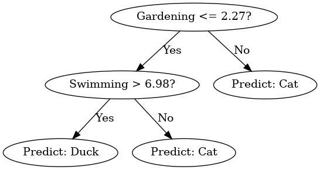                   | Low Gardening (≤2.27) and high Swimming (>6.98) lead to Duck. |
| **Gardening, Swimming and Art Driven Duck**     | 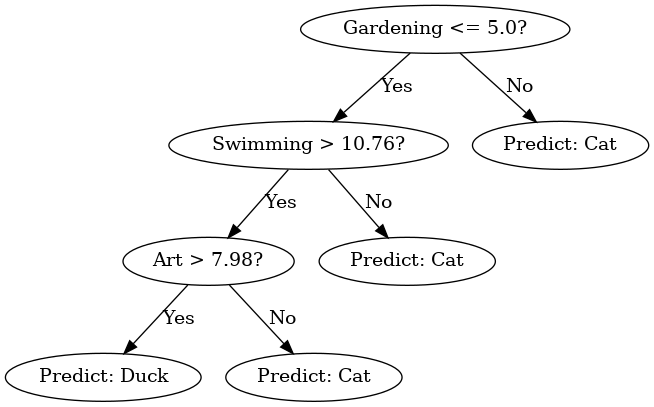               | Very high Swimming (>10.76) and high Art (>7.98) predict Duck. |
| **Gardening, Swimming, Detective Stories Duck** | 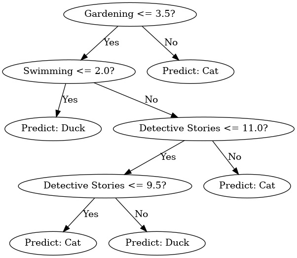 | Combination of low Gardening, low Swimming, and moderate Detective Stories predicts Duck. |

---

### PDP (1D and 2D) Analysis for Duck Class

Partial Dependence Plots (PDP) and Individual Conditional Expectation (ICE) plots provide further insight into **how individual features influence the probability of predicting Duck**.

#### 1D PDP + ICE Observations

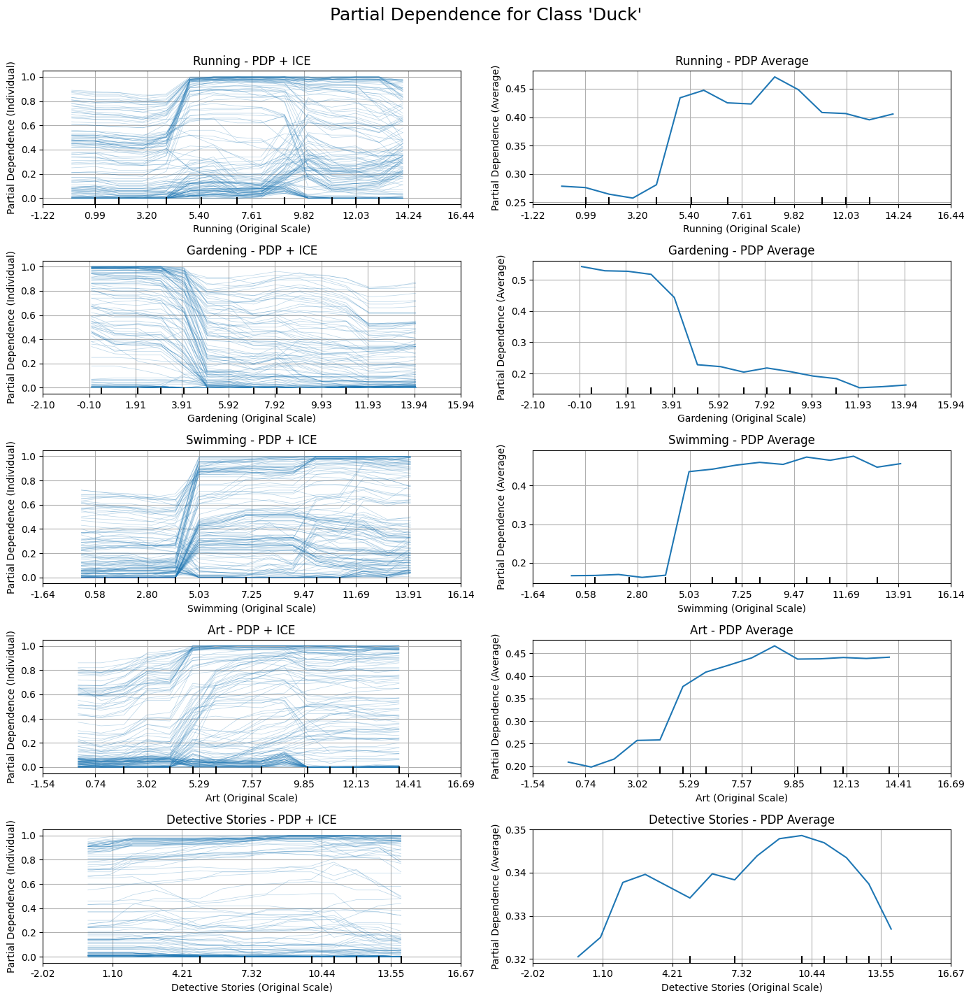

- **Running**: Probability of Duck prediction increases after ~4, peaks around 7–9, and then remains high.
- **Gardening**: Higher Gardening scores (>5) strongly decrease the probability of predicting Duck.
- **Swimming**: Strong positive effect between ~5 and 10 on Swimming scale — high Swimming favors Duck prediction.
- **Art**: Moderate to high Art scores (~6–12) slightly increase Duck probability.
- **Detective Stories**: Probability first increases slightly, peaks around ~7–9, then decreases beyond 10.

> **Insight**: High Swimming and moderate Art favor Duck prediction. Low Gardening is a strong signal for Duck.

---

#### 2D PDP Observations

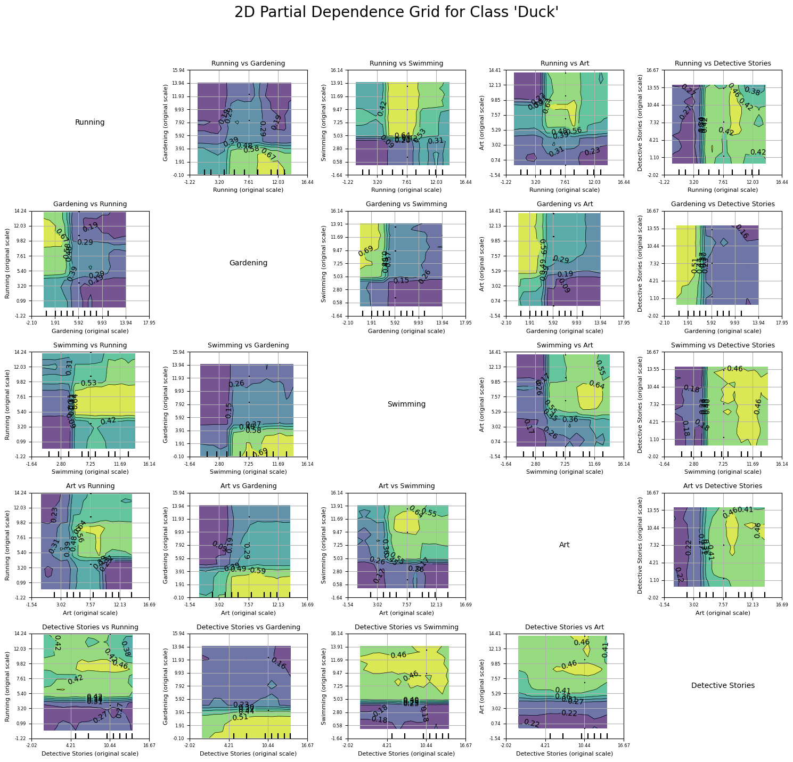

- **Running vs Swimming**: High Swimming combined with moderate Running (~5–8) enhances Duck probability.
- **Gardening vs Swimming**: Low Gardening and moderate-high Swimming are associated with high Duck probability.
- **Swimming vs Art**: Combined moderate Swimming and moderate Art boost Duck prediction.
- **Gardening vs Art**: Low Gardening and moderate Art support Duck prediction.
- **Detective Stories interactions**: Medium Detective Stories (~7–9) support Duck predictions when combined with high Swimming, but very high Detective Stories (>12) reduce Duck probability.

> **Conclusion**: Duck predictions are strongest when Swimming is high, Gardening is low, and moderate support from Art or moderate Detective Stories exists.

---
## Duck Class Summary Profile

### 1. Most Influential Features and Their Behavior

- **Gardening** is the **most influential negative feature overall**.
  - Duck probability **decreases strongly** when Gardening exceeds 5.
  - Low Gardening (<4) favors Duck prediction.

- **Swimming** is the **second most influential mixed feature**.
  - **Strong positive contribution** when Swimming values are between 5 and 10.
  - Very high Swimming (>12) maintains but slightly moderates Duck probability.

- **Running** has a **moderate positive influence**.
  - Duck probability increases after Running exceeds ~4–5 and peaks around 7–9.

- **Art** plays a **moderate mixed role**.
  - Moderate to high Art scores (6–12) slightly increase Duck probability.
  - Very high or low Art slightly reduce Duck probability

- **Detective Stories** have a **week mixed influence**.
  - Moderate Detective Stories (~7–9) slightly favor Duck prediction.
  - Very high Detective Stories (>12) **reduce** Duck probability.

---

### 2. Key Ranges for Main Features

| Feature | Positive Range (for Duck) | Negative Range (against Duck) |
|:---|:---|:---|
| Gardening | < 4 | > 5 |
| Swimming | 5–10 | Low (<3) or very high (>13) |
| Running | 5–9 | Very low (<2) or very high (>12) |
| Art | 6–12 | Very low (<3) or very high (>13) |
| Detective Stories | 7–9 (moderate) | > 12 |

---

### 3. Feature Interactions

- **Gardening + Swimming**:
  - Ducks are most likely when **Gardening is low** and **Swimming is moderate to high**.
  - Low Gardening **amplifies** the positive impact of Swimming.

- **Running + Swimming**:
  - Moderate Running (5–9) combined with high Swimming enhances Duck prediction.

- **Swimming + Art**:
  - Moderate Swimming with moderate Art improves Duck probability.

- **Detective Stories interactions**:
  - Moderate Detective Stories (~7–9) combined with high Swimming or high Art favor Duck predictions.
  - Very high Detective Stories (>12) weaken Duck probability even if Swimming is high.

---

### 4. Subgroups Inside Duck Class (Duck Profiles)

- **Aquatic Nature Duck**:
  - **Low Gardening**, **High Swimming**.
  - Represents Ducks modeled around active outdoor and water-oriented hobbies.

- **Creative Aquatic Duck**:
  - **Very High Swimming** and **High Art**.
  - Combines physical and creative activities to form a distinct Duck profile.

- **Logical Low-Activity Duck**:
  - **Low Gardening**, **Moderate Swimming**, **Moderate Detective Stories**.
  - Reflects Ducks who engage moderately in water activities and analytical hobbies.

> **Overall Insight**:
> - Duck classification emerges from a **delicate combination** of features.
> - **Low Gardening** and **high Swimming** are fundamental to Duck prediction.
> - **Moderate Art** and **moderate Detective Stories** act as supporting features.
> - Multiple **Duck profiles** coexist, depending on the balance between physical and intellectual hobbies.

---

# Cat

## Key Features from SHAP

- **Swimming** is the strongest feature for predicting Cat.
  - It has the highest mean SHAP value for the Cat class across barplots and boxplots.
- **Running** is the second most important feature.
  - Consistently strong effect, slightly lower than Swimming but significant.
- **Art** plays a moderate role.
  - Positive for some Cats, but less influential compared to Swimming and Running.
- **Gardening** has minimal influence.
  - Very low SHAP contribution overall.
- **Detective Stories** has very little to no influence on Cat predictions.

> **Insight**: Cat classification is **mostly driven by strong Swimming and Running patterns**, with some occasional support from Art.

---

## Cluster-Based SHAP Analysis

- Across clusters, **Swimming** remains the dominant feature, consistently strong in all subgroups.
- **Running** also maintains its role across clusters but shows slightly more variability compared to Swimming.
- **Art** varies across clusters:
  - In some clusters, Art has a moderate positive effect.
  - In others, its importance is minimal.
- **Gardening** and **Detective Stories** stay consistently low in all clusters, with little effect on Cat prediction.

---

| Plot | Description |
|:---|:---|
| 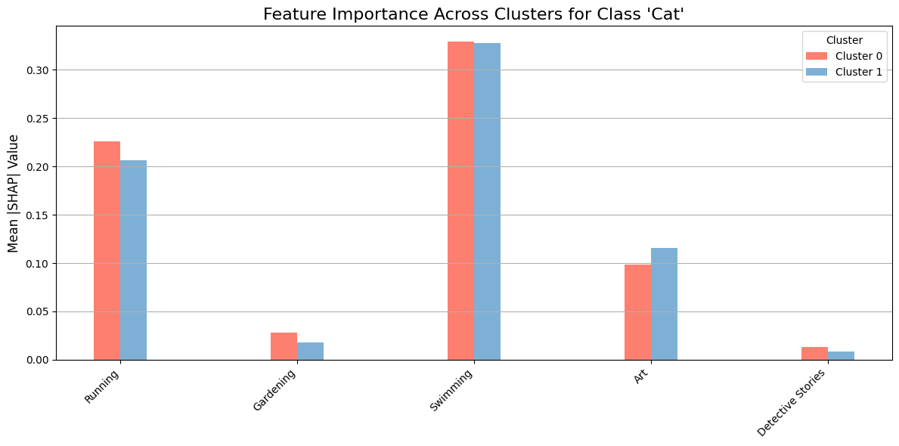 | Feature importance across 2 Cat subgroups (KMeans). |
| 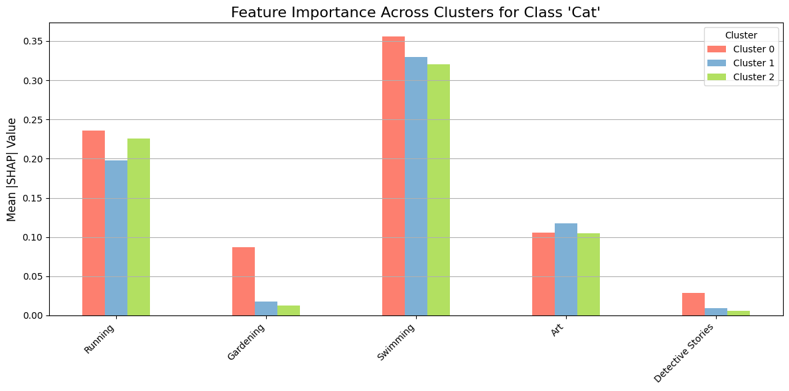 | Feature importance across 3 Cat subgroups. |
| 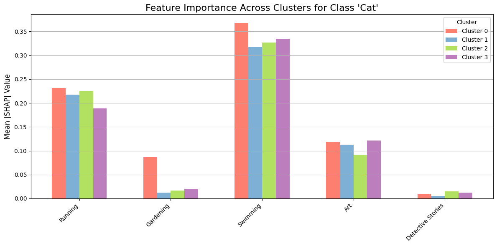 | Feature importance across 4 Cat subgroups. |
| 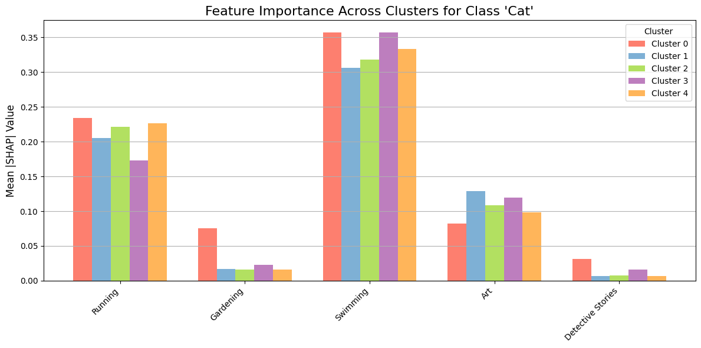 | Feature importance across 5 Cat subgroups. |

---

### Summary of SHAP Analysis for Cat:

- **Swimming > Running > Art** hierarchy overall.
- Subgroups show that some Cats are **purely Swimming-based**, while others rely on a combination of **Swimming and Running**.
- **Art** has variable but minor importance depending on the subgroup.
- **Gardening** and **Detective Stories** remain negligible across all Cats.

---

## Anchor Explanations

Anchors identify **feature conditions** under which the model predicts Cat with high precision.

| Anchor | Conditions | Precision | Coverage |
|:------:|:-----------|:---------:|:--------:|
| 1 | `Swimming <= 2.98`, `Running <= 6.99`, `Art > 7.98` | 1.000 | 19.92% |
| 2 | `Swimming <= 2.98`, `Art > 7.98`, `Detective Stories > 11.00` | 0.959 | 10.64% |
| 3 | `Swimming <= 6.98`, `Running <= 3.02`, `Art > 11.99` | 0.977 | 10.55% |

---

### Interpretation

- **Anchor 1**:
  - Cats with low Swimming (<=2.98), low Running (<=6.99), and high Art (>7.98) are predicted with perfect precision (100%).
  - This anchor covers almost 20% of Cat instances, making it a very strong rule.

- **Anchor 2**:
  - A more specific rule: low Swimming (<=2.98), high Art (>7.98), and very high Detective Stories interest (>11.00).
  - Precision is high (95.9%) but coverage is smaller (10.6%).

- **Anchor 3**:
  - Cats with moderate Swimming (<=6.98), very low Running (<=3.02), and extremely high Art (>11.99) are predicted with 97.7% precision.
  - Covers about 10.5% of Cat samples.

---

### Conclusion

- Cat predictions are strongly anchored by high Art interest combined with low Swimming and low Running scores.
- Detective Stories become important only in more specific Cat subgroups.
- Anchors reveal that Cats are consistently associated with creative or intellectual hobbies (high Art and Detective Stories) and lower physical activity (low Swimming and Running).

---

## Tree Extraction and Impact Analysis

### Approach

- Extracted decision rules from individual trees in the Random Forest.
- Focused on paths leading to the Cat class.
- Selected short, interpretable paths (2–4 conditions) for visualization.
- Built simple decision tree diagrams to show key splits and decisions.

---

### Impact on Analysis

| Aspect | Impact |
|:------|:-------|
| **Understanding Key Features** | Highlighted Swimming, Running, and Art as dominant features. |
| **Finding Important Thresholds** | Revealed important splits (e.g., Swimming <= 2.98, Running <= 6.99, Art > 7.98). |
| **Identifying Feature Interactions** | Showed that combinations, not single features alone, drive predictions. |
| **Recognizing Heterogeneity** | Different paths reflect different types of Cat profiles. |
> **Note**: Tree visualization helped bridge the gap between global feature importance (SHAP) and local decision rules (Anchors).

---

### General Behavior of Cat Class

- **Heterogeneous Decision Patterns**: Cat predictions emerge through multiple combinations of low physical activity (low Swimming, low Running) and high creative interest (high Art).
- **Swimming** is the most stable negative indicator — low Swimming strongly favors Cat prediction.
- **Running** complements Swimming — Cats often have both Swimming and Running scores low.
- **Art** acts as a strong positive driver — higher Art scores are associated with Cat predictions.
- **Gardening** and **Detective Stories** play minimal roles in Cat decision paths.

> **Conclusion**: Cat classification is primarily driven by **low physical activity (low Swimming and Running)** combined with **high Art preference**.

---

### Cat Profile Selection and Visualization

#### Approach to Profile Selection

We selected three Cat profiles based on real extracted decision paths to illustrate the variety inside the Cat class:

| Profile | Key Features | Represents |
|:---|:---|:---|
| **Swimming and Running Limited Cat** | Very Low Swimming, Low Running, High Art | "Creative Low-Activity Cat" |
| **Swimming Limited, Detective Stories Enhanced Cat** | Very Low Swimming, High Detective Stories, High Art | "Intellectual Cat" |
| **Moderate Swimming, Very High Art Cat** | Low-Moderate Swimming, Very High Art | "Artistic Cat" |

---

#### Cat Profile Visualizations

| Profile                                          | Decision Tree Visualization                                               | Key Notes |
|:-------------------------------------------------|:--------------------------------------------------------------------------|:---|
| **Swimming and Running Limited Cat**             | 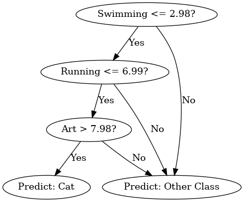           | Very low Swimming (≤2.98) and low Running (≤6.99) combined with high Art (>7.98) predict Cat. |
| **Low Swimming, Detective Stories Enhanced Cat** | 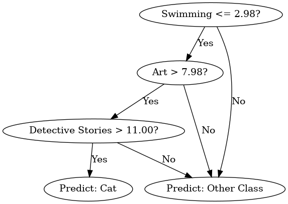 | Very low Swimming (≤2.98), high Art (>7.98), and very high Detective Stories (>11.00) predict Cat. |
| **Moderate Swimming, Very High Art Cat**         | 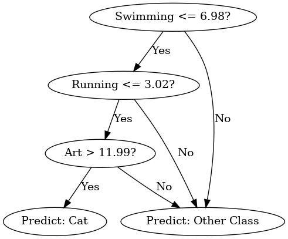               | Moderate Swimming (≤6.98), low Running (≤3.02), and very high Art (>11.99) lead to Cat prediction. |

---

### PDP (1D and 2D) Analysis for Cat Class

Partial Dependence Plots (PDP) and Individual Conditional Expectation (ICE) plots provide further insight into **how individual features influence the probability of predicting Cat**.

#### 1D PDP + ICE Observations

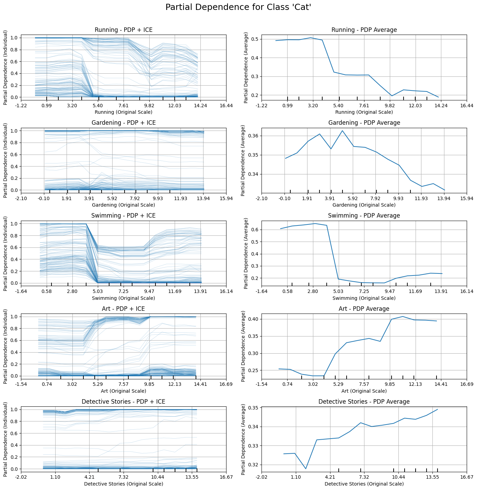

- **Running**: Lower Running values (<4–5) strongly favor Cat prediction. Higher Running sharply reduces Cat probability.
- **Gardening**: Very low Gardening (close to 0–2) slightly supports Cat prediction. Higher Gardening decreases Cat probability.
- **Swimming**: Very low Swimming (<5) dramatically increases Cat probability. Higher Swimming greatly decreases Cat prediction.
- **Art**: Higher Art scores (>6) steadily increase the probability of predicting Cat.
- **Detective Stories**: Higher Detective Stories scores (>5) modestly increase Cat probability.

> **Insight**: Low Swimming, low Running, and high Art are strong conditions for Cat prediction.

---

#### 2D PDP Observations

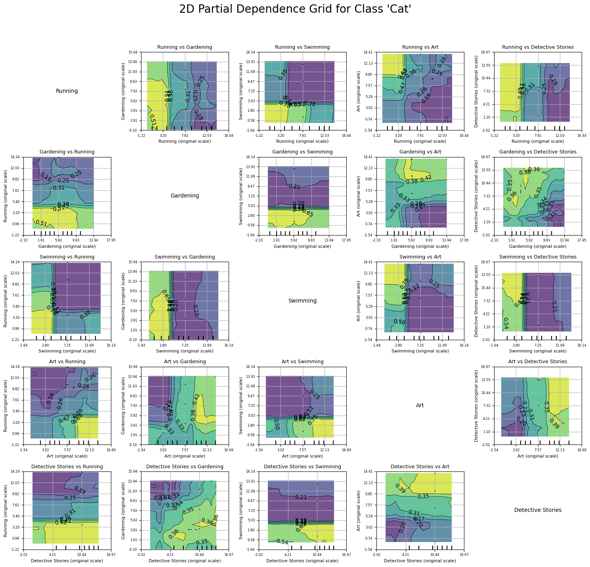

- **Running vs Swimming**: Very low Swimming and moderate Running result in the highest Cat probabilities.
- **Gardening vs Swimming**: Very low Gardening and very low Swimming favor Cat predictions.
- **Swimming vs Art**: Low Swimming combined with high Art greatly enhances Cat prediction.
- **Art vs Detective Stories**: High Art and moderate to high Detective Stories further support Cat prediction.
- **Detective Stories interactions**: High Detective Stories improve Cat probability when paired with high Art or low Swimming.

> **Conclusion**: Cat predictions are strongest for instances with **very low Swimming**, **low Running**, and **high Art** —  
with **Detective Stories** acting as a secondary supportive feature.

---

## Cat Class Summary Profile

### 1. Most Influential Features and Their Behavior

- **Swimming** is the most influential negative feature overall.
  - Cat probability **rises strongly** when Swimming is **very low (<5)**.
  - High Swimming (>6) quickly decreases Cat probability.

- **Running** is the second most influential negative feature.
  - Cat prediction **increases** when Running is **low (<4–5)**.
  - Higher Running reduces Cat probability steadily.

- **Art** has a **moderate positive influence**.
  - Higher Art scores (>6) consistently improve Cat prediction.
  - Very high Art (>11) further reinforces Cat classification.

- **Gardening** plays a **minor negative influence** at very low values.
  - Very low Gardening (0–2) slightly supports Cat predictions.

- **Detective Stories** have a **secondary supportive effect**.
  - Higher Detective Stories (>5) moderately favor Cat prediction.
  - Very high Detective Stories (>11) enhance Cat probability in specific subgroups.

---

### 2. Key Ranges for Main Features

| Feature | Positive Range (for Cat) | Negative Range (against Cat) |
|:---|:---|:---|
| Swimming | < 5 | > 6 |
| Running | < 5 | > 7 |
| Art | > 6 | < 3 |
| Gardening | 0–2 (slight support) | > 5 |
| Detective Stories | > 5 (moderate) | < 3 |

---

### 3. Feature Interactions

- **Swimming + Running**:
  - Very low Swimming and low Running maximize Cat probability.
  - Moderate Running (5–8) with low Swimming still supports Cats but weaker.

- **Swimming + Art**:
  - Low Swimming combined with high Art strongly favors Cat prediction.
  - Art compensates if Swimming is moderately low.

- **Art + Detective Stories**:
  - High Art together with moderately high Detective Stories enhances Cat probability.
  - Detective Stories alone are weaker but reinforce Art-driven Cat profiles.

---

### 4. Subgroups Inside Cat Class (Cat Profiles)

- **Creative Low-Activity Cat**:
  - **Very low Swimming**, **low Running**, **high Art**.
  - Represents Cats modeled around creative indoor hobbies with low physical activity.

- **Intellectual Cat**:
  - **Very low Swimming**, **high Art**, **high Detective Stories**.
  - Combines intellectual activities with limited physical hobbies.

- **Artistic Cat**:
  - **Moderate Swimming**, **very high Art**.
  - Less extreme low activity, but heavily creativity-driven Cat profile.

> **Overall Insight**:
> - Cat classification is **primarily driven by low physical activity** (low Swimming and Running).
> - **High Art** serves as a strong and consistent positive driver.
> - **Detective Stories** act as secondary features enhancing specific Cat profiles.
> - Multiple **Cat strategies** coexist depending on balance between creativity and physical activity levels.

---
